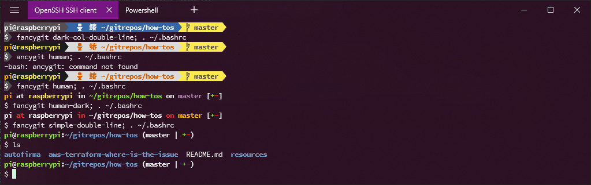

## How-To's

Repository with technical indications to install, configure any interesting stuff. 

### Resources

1. [FizzBuzz Python test](resources/fizzbuzz1.py)
2. [NewPassword Generator Java test](resources/NewPasswordGenerator.java)
3. [Preparing-Python-Dev-Env-Mac-OSX](resources/preparing_python_dev_env_mac_osx.md)
4. [Disabling sleeping when close laptop lid](resources/disable_sleeping_when_close_laptop_lid.md)
5. Install IDE and DevOps tools (MS VSCode, extensions, Terraform, Packer, Java, AWS Cli, etc.) in **Ubuntu**
   ```sh
   $ wget -q https://raw.githubusercontent.com/chilcano/how-tos/master/resources/[devops_tools_install_v1.sh](resources/devops_tools_install_v1.sh)
   $ chmod +x devops_tools_install_v1.sh  
   $ . devops_tools_install_v1.sh
   ```  
6. Install IDE and DevOps tools:  
   * Install/remove only **Code-Server** in Ubuntu (amd64):
      ```sh
      $ wget -q https://raw.githubusercontent.com/chilcano/how-tos/master/resources/[code_server_install.sh](resources/code_server_install.sh)
      $ wget -q https://raw.githubusercontent.com/chilcano/how-tos/master/resources/[code_server_remove.sh](resources/code_server_remove.sh)
      $ chmod +x code_server_install.sh code_server_remove.sh
      $ . code_server_install.sh
      $ . code_server_remove.sh
      ```
   * Install/remove only **Code-Server** in Raspberry Pi (arm):
      ```sh
      $ wget -q https://raw.githubusercontent.com/chilcano/how-tos/master/resources/[code_server_install_rpi.sh](resources/code_server_install_rpi.sh)
      $ wget -q https://raw.githubusercontent.com/chilcano/how-tos/master/resources/[code_server_remove_rpi.sh](resources/code_server_remove_rpi.sh)
      $ chmod +x code_server_install_rpi.sh code_server_remove_rpi.sh
      $ . code_server_install_rpi.sh
      $ . code_server_remove_rpi.sh
      ```
   * Install/remove only **Code-Server** in WLS2 (Ubuntu 20.04):
      ```sh
      $ wget -q https://raw.githubusercontent.com/chilcano/how-tos/master/resources/<a href="resources/code_server_install_wsl2.sh">code_server_install_wsl2.sh</a> 
      $ wget -q https://raw.githubusercontent.com/chilcano/how-tos/master/resources/[code_server_remove.sh](resources/code_server_remove_wsl2.sh)
      $ chmod +x code_server_install_wsl2.sh code_server_remove_wsl2.sh
      $ . code_server_install_wsl2.sh
      $ . code_server_remove_wsl2.sh
      ```
   * Install only **DevOps tools**. It works in Ubuntu (amd64), Raspberry Pi (arm) and WSL2 (Ubuntu/amd64).
      ```sh
      $ wget https://raw.githubusercontent.com/chilcano/how-tos/master/resources/[devops_tools_install_v2.sh](resources/devops_tools_install_v2.sh)  
      $ chmod +x devops_tools_install_v2.sh 
      $ . devops_tools_install_v2.sh --arch=[amd|arm] [--tf-ver=0.11.15-oci] [--packer-ver=1.5.5]
      ```
7. Customizing the Ubuntu Prompt  
   - [With Synth Shell](resources/fancy_prompt_with_synth_shell.md)   
        
   - [With Fancy GIT](resources/fancy_prompt_with_fancy_git.md)  
       

8. [Install custom Fonts in Ubuntu](resources/install_fonts_in_ubuntu.sh)  
   ```sh
   $ wget https://raw.githubusercontent.com/chilcano/how-tos/master/resources/install_fonts_in_ubuntu.sh
   $ chmod +x install_fonts_in_ubuntu.sh
   $ . install_fonts_in_ubuntu.sh
   ```  
9. Installing **Jekyll** (Ruby, Ruby-dev, build-essential, zlib1g-dev, Gem, Bundler, etc.) in Linux. Tested in Ubuntu 18.04 or above and Raspbian/Raspberry Pi OS.
   ```sh
   $ wget https://raw.githubusercontent.com/chilcano/how-tos/master/resources/[setting_jekyll_in_linux.sh](resources/setting_jekyll_in_linux.sh) 
   $ chmod +x setting_jekyll_in_linux.sh
   $ . setting_jekyll_in_linux.sh
   ```
   Running Jekyll:   
   ```sh
   $ JEKYLL_ENV=production bundle exec jekyll serve --incremental --watch
   $ JEKYLL_ENV=production bundle exec jekyll serve --incremental --watch --host=0.0.0.0
   $ JEKYLL_ENV=production bundle exec jekyll serve --watch --drafts
   ```
10. GIT guides:
   - [Github - Persisting credentials](resources/git_saving_credentials.md)
   - [Github - Pull Request](resources/git_pull_request_guide.md)
11. [Getting CPU and GPU temperature in Ubuntu 19.04](resources/getting_temperature_cpu_gpu_hd_in_ubuntu.md)
12. [Installing Logitech Unifying (Keyboard adn mice) in Ubuntu 19.04](resources/installing_logitech_unifying_in_ubuntu_19_04.md)
13. [Install and configure Asus MB168b screen in Ubuntu 18.04](resources/install_and_setup_mb168b_in_ubuntu.md)
14. [Working with Tmux](resources/working_with_tmux.md)
15. [File sharing through Samba(SMB)](resources/install_and_config_samba.md)
16. [Terraforms samples - where is the issue?](aws-terraform-where-is-the-issue/) 
17. AWS CloudFormation samples:  
   - Convert JSON to YAML.  
     ```sh
     $ ruby -ryaml -rjson -e 'puts YAML.dump(JSON.load(ARGF))' < cloudformation_template_example.json > cloudformation_template_example.yaml
     ```
   - [Creating an Affordable Remote DevOps Desktop with AWS CloudFormation](https://github.com/chilcano/affordable-remote-desktop/tree/master/resources/cloudformation)
   - [Deploying AWS ECS Networking and Architecture Patterns](https://github.com/chilcano/cfn-samples/tree/master/ECS/README.md)
   
  