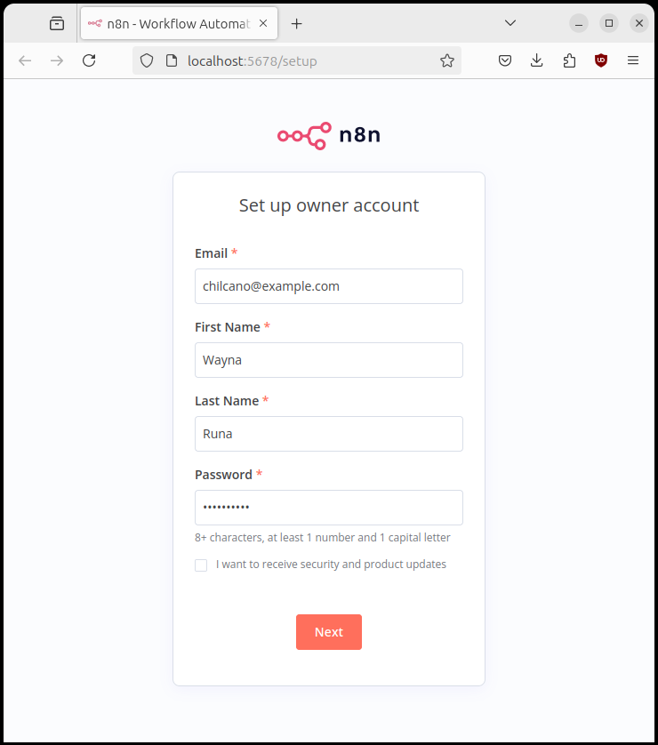

# Automation with n8n

## Steps

### 1. Install locally


__n8n with SQLite__

```sh
docker volume create n8n_data
docker volume create n8n_logs
docker volume ls

# run n8s with setup by default in interactive mode
docker run -it --rm \
 --name n8n \
 -p 5678:5678 \
 -v n8n_data:/home/node/.n8n \
 docker.n8n.io/n8nio/n8n

# you will see the next logs:
...
Digest: sha256:f3e79e9fac6f1f65370e6018e928c038da64a39d8f1b36f7c70a02d11a55596f
Status: Downloaded newer image for docker.n8n.io/n8nio/n8n:latest
No encryption key found - Auto-generated and saved to: /home/node/.n8n/config
Initializing n8n process
n8n ready on 0.0.0.0, port 5678
...
Version: 1.45.1

Editor is now accessible via:
http://localhost:5678/

Press "o" to open in Browser.
```


Create the owner account:


Overwriting some environment variables:
```sh
# run n8n in debug mode and writting logs in volume in detached mode
docker run -itd --rm \
 --name n8n \
 -p 5678:5678 \
 -e N8N_LOG_LEVEL=debug \
 -e N8N_LOG_OUTPUT=console,file \
 -e N8N_LOG_FILE_LOCATION=/home/node/logs/n8n.log \
 -v n8n_data:/home/node/.n8n \
 -v n8n_logs:/home/node/logs \
 docker.n8n.io/n8nio/n8n

b767624d252c8a991d2decec14e109a74114612fddc826d3e17316090a50fb0b

# print logs
ocker logs -f n8n 

User settings loaded from: /home/node/.n8n/config
2024-06-17T13:11:08.285Z | info     | Initializing n8n process "{ file: 'start.js', function: 'init' }"
...
2024-06-17T13:11:09.073Z [Rudder] debug: no existing flush timer, creating new one

Editor is now accessible via:
http://localhost:5678/

Press "o" to open in Browser.
2024-06-17T13:11:10.413Z | debug    | Skipped browserId check on /rest/push "{ file: 'auth.service.js', function: 'resolveJwt' }"
2024-06-17T13:11:10.414Z | debug    | Add editor-UI session "{ pushRef: '4r4h9c6mr1c', file: 'abstract.push.js', function: 'add' }"
2024-06-17T13:11:19.075Z [Rudder] debug: in flush
2024-06-17T13:11:19.075Z [Rudder] debug: cancelling existing flushTimer...

# getting interactive terminal
docker exec -it n8n sh  

~ $ pwd
/home/node

~ $ ls -la
total 32
drwxr-sr-x    1 node     node          4096 Jun 17 13:29 .
drwxr-xr-x    1 root     root          4096 May  9 19:27 ..
-rw-------    1 node     node            11 Jun 17 13:29 .ash_history
drwxr-sr-x    3 node     node          4096 Jun 17 13:11 .cache
drwxr-sr-x    5 node     node          4096 Jun 17 13:20 .n8n
drwxr-sr-x    3 node     node          4096 Jun 17 13:11 .npm
drwxr-xr-x    2 root     root          4096 Jun 17 12:51 logs
```


### 2. Advanced installation using Docker

__n8n with PostgresDB__

```sh
docker volume create n8n_data

docker run -it --rm \
 --name n8n \
 -p 5678:5678 \
 -e DB_TYPE=postgresdb \
 -e DB_POSTGRESDB_DATABASE=<POSTGRES_DATABASE> \
 -e DB_POSTGRESDB_HOST=<POSTGRES_HOST> \
 -e DB_POSTGRESDB_PORT=<POSTGRES_PORT> \
 -e DB_POSTGRESDB_USER=<POSTGRES_USER> \
 -e DB_POSTGRESDB_SCHEMA=<POSTGRES_SCHEMA> \
 -e DB_POSTGRESDB_PASSWORD=<POSTGRES_PASSWORD> \
 -v n8n_data:/home/node/.n8n \
 docker.n8n.io/n8nio/n8n
```


__Setting timezone__

```sh
docker volume create n8n_data

docker run -it --rm \
 --name n8n \
 -p 5678:5678 \
 -e GENERIC_TIMEZONE="Europe/Berlin" \
 -e TZ="Europe/Berlin" \
 -v n8n_data:/home/node/.n8n \
 docker.n8n.io/n8nio/n8n
```

__n8n with tunnel__

```sh
docker volume create n8n_data

docker run -it --rm \
 --name n8n \
 -p 5678:5678 \
 -v n8n_data:/home/node/.n8n \
 docker.n8n.io/n8nio/n8n \
 start --tunnel
```

### 2. Update & Remove


__Using Docker__
```sh
# Pull latest (stable) version
docker pull docker.n8n.io/n8nio/n8n

# Pull specific version
docker pull docker.n8n.io/n8nio/n8n:0.220.1

# Pull next (unstable) version
docker pull docker.n8n.io/n8nio/n8n:next

# Get the container ID
docker ps -a

# Stop the container with ID container_id
docker stop [container_id]

# Remove the container with ID container_id
docker rm [container_id]

# Start the container
docker run --name=[container_name] [options] -d docker.n8n.io/n8nio/n8n
```

__Using Docker Compose__

```sh
# Pull latest version
docker compose pull

# Stop and remove older version
docker compose down

# Start the container
docker compose up -d
```

### 3. Workflows

Import any existing workflow from `n8n > templates` or n8n's website.

```json

```