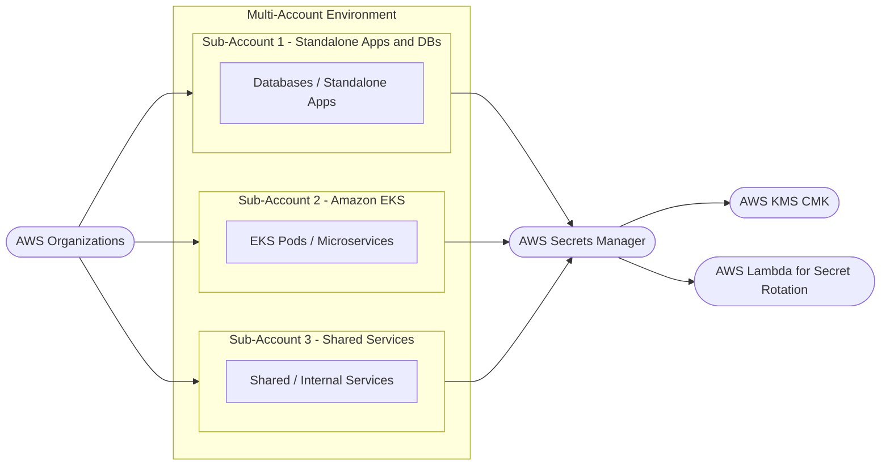

# AWS Secrets Manager

## Architecture

### Mermaid diagram 

```mermaid
flowchart LR
    A(["AWS Organizations"])
    
    %% High-Level Grouping of Sub-Accounts
    subgraph Multi-Account Environment
      subgraph S1["Sub-Account 1 - Standalone Apps and DBs"]
        DB1["Databases / Standalone Apps"]
      end

      subgraph S2["Sub-Account 2 - Amazon EKS"]
        EKSApps["EKS Pods / Microservices"]
      end

      subgraph S3["Sub-Account 3 - Shared Services"]
        Shared["Shared / Internal Services"]
      end
    end

    SM(["AWS Secrets Manager"])
    KMS(["AWS KMS CMK"])
    Lambda(["AWS Lambda for Secret Rotation"])

    %% Connections from AWS Organizations to each sub-account
    A --> S1
    A --> S2
    A --> S3

    %% Each sub-account communicates with AWS Secrets Manager (conceptually centralized)
    S1 --> SM
    S2 --> SM
    S3 --> SM

    %% AWS Secrets Manager integrates with KMS (for encryption) and Lambda (for rotation)
    SM --> KMS
    SM --> Lambda

```

