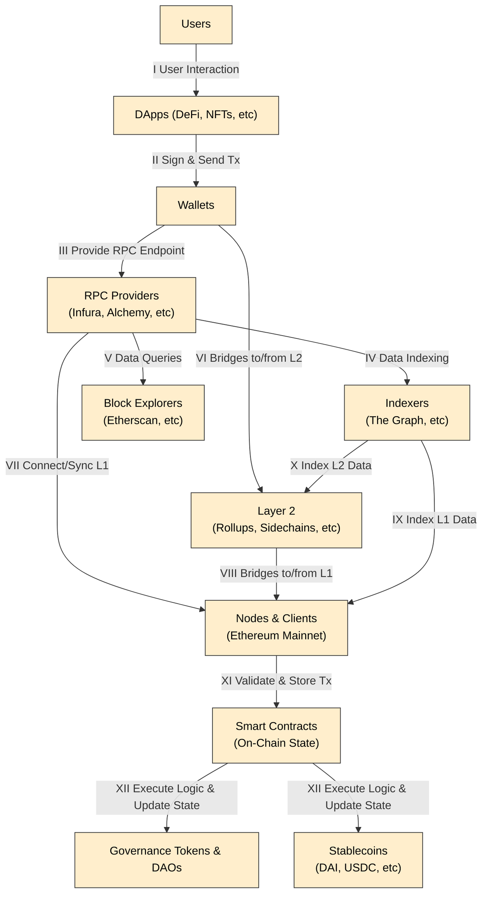

# Ethereum Ecosystem Map

## Map 0

### Mermaid diagram 

### How to Read the Diagram

## How to Read the Diagram

I. **User Interaction**  
   Users interact with DApps (DeFi, NFTs, etc.).

II. **Sign & Send Transactions**  
   DApps request users to sign transactions through their Wallets.

III. **Provide RPC Endpoint**  
   Wallets rely on RPC Providers (e.g., Infura, Alchemy) to connect to Ethereum.

IV. **Data Indexing**  
   RPC Providers feed data to Indexers (e.g., The Graph) for easier querying.

V. **Data Queries**  
   Block Explorers (e.g., Etherscan) request data through RPC endpoints or indexers to display blockchain information.

VI. **Bridges to/from L2**  
   Wallets and DApps can move assets between Layer 2 solutions (rollups, sidechains) and Ethereum L1.

VII. **Connect/Sync L1**  
   RPC Providers also connect/sync with Nodes & Clients on Ethereum Mainnet to broadcast transactions and fetch data.

VIII. **Bridges to/from L1**  
   Layer 2 solutions have bridges allowing transfer of assets or data back to L1.

IX. **Index L1 Data**  
   Indexers retrieve and structure on-chain data directly from Ethereum Mainnet (L1).

X. **Index L2 Data**  
   Indexers can also pull data from Layer 2 networks for DApps that operate partially off the main chain.

XI. **Validate & Store Tx**  
   Nodes & Clients validate transactions and produce blocks on Ethereum Mainnet, ensuring consensus and security.

XII. **Execute Logic & Update State**  
   Smart Contracts run the on-chain logic for DeFi, NFTs, Governance (DAOs), and Stablecoins (e.g., DAI, USDC).
