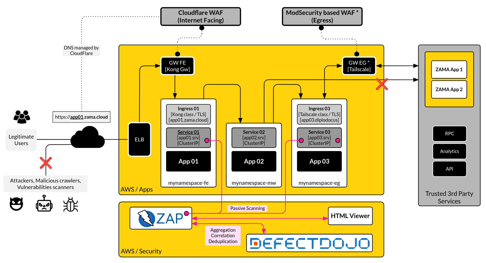

# OWASP ZAP Guide



## 1. Deploy ZAP, Report Viewer and Scan CronJob

```sh
# install
kubectl create namespace dast
kubectl -n dast apply -f zap-reports-pvc.yaml
kubectl -n dast apply -f zap-scan-deployment.yaml
kubectl -n dast apply -f zap-report-viewer-deployment.yaml
kubectl -n dast apply -f zap-scan-cronjob.yaml

## check
kubectl -n dast get all 
kubectl -n dast get deployment,rs,pod,svc,ing,pvc,cronjob

# get hashes
kubectl -n dast get configmap zap-scan-plans -o json | sha256sum | cut -d' ' -f1 
kubectl -n dast get configmap zap-report-viewer -o json | sha256sum | cut -d' ' -f1

## remove
kubectl -n dast delete pvc zap-reports-pvc
kubectl -n dast delete -f zap-reports-pvc.yaml
kubectl -n dast delete -f zap-scan-deployment.yaml
kubectl -n dast delete -f zap-report-viewer-deployment.yaml
kubectl -n dast delete -f zap-scan-cronjob.yaml
kubectl delete namespace dast
```

## 2. Access to ZAP scan pod

```sh
kubectl exec -it -n dast deploy/zap-scan -- bash

# zap help, version
kubectl exec -it -n dast deploy/zap-scan -- zap.sh -h
kubectl exec -it -n dast deploy/zap-scan -- zap.sh -version

# check plans
kubectl exec -it -n dast deploy/zap-scan -- ls -la /zap/wrk/plans/
kubectl exec -it -n dast deploy/zap-scan -- cat /zap/wrk/plans/scan-plan-test1.yaml

# zap policies
kubectl exec -it -n dast deploy/zap-scan -- ls -la /root/.ZAP/policies/
kubectl exec -it -n dast deploy/zap-scan -- ls -la /home/zap/.ZAP/policies/

# check reports generated and size (vol 1G)
kubectl exec -it -n dast deploy/zap-scan -- ls -la /zap/wrk/out/
kubectl exec -it -n dast deploy/zap-scan -- sh -c 'du -sh /zap/wrk/out/*'
kubectl exec -it -n dast deploy/zap-scan -- sh -c 'du -sh /zap/wrk/out/* | sort -h'

# delete reports
kubectl exec -it -n dast deploy/zap-scan -- sh -c 'rm -rf /zap/wrk/out/out-zap.*'
```

### 2.1. Run ZAP scan

> Update the ZAP Addons before scanning

```sh
kubectl exec -it -n dast deploy/zap-scan -- bash -c "zap.sh -cmd -addonupdate"
```

**Scan by running kubectl locally**
```sh
## test1=juiceshop, test2=cyberchef
kubectl exec -it -n dast deploy/zap-scan -- sh -c 'REPORT_DIR=/zap/wrk/out PRODUCT_NAME=JUICESHOP REPORT_DATE=$(date +%y%m%d-%H%M%S) zap.sh -cmd -autorun /zap/wrk/plans/scan-plan-test1.yaml'
kubectl exec -it -n dast deploy/zap-scan -- bash -c "REPORT_DIR=/zap/wrk/out PRODUCT_NAME=CYBERCHEF REPORT_DATE=$(date +%y%m%d-%H%M%S) zap.sh -cmd -autorun /zap/wrk/plans/scan-plan-test2.yaml"

## 01=FRONT, 02=BACK
kubectl exec -it -n dast deploy/zap-scan -- sh -c 'REPORT_DIR=/zap/wrk/out PRODUCT_NAME=FRONT REPORT_DATE=$(date +%y%m%d-%H%M%S) zap.sh -cmd -autorun /zap/wrk/plans/scan-plan-01.yaml'
kubectl exec -it -n dast deploy/zap-scan -- bash -c "REPORT_DIR=/zap/wrk/out PRODUCT_NAME=BACK REPORT_DATE=$(date +%y%m%d-%H%M%S) zap.sh -cmd -autorun /zap/wrk/plans/scan-plan-02.yaml"
```

**Scan by running zap.sh from pod**
```sh
## test1=juiceshop, test2=cyberchef
REPORT_DIR=/zap/wrk/out PRODUCT_NAME=JUICESHOP REPORT_DATE=$(date +%y%m%d-%H%M%S) zap.sh -cmd -autorun /zap/wrk/plans/scan-plan-test1.yaml

REPORT_DIR=/zap/wrk/out PRODUCT_NAME=CYBERCHEF REPORT_DATE=$(date +%y%m%d-%H%M%S) zap.sh -cmd -autorun /zap/wrk/plans/scan-plan-test2.yaml

## 01=FRONT, 02=BACK
REPORT_DIR=/zap/wrk/out PRODUCT_NAME=FRONT REPORT_DATE=$(date +%y%m%d-%H%M%S) zap.sh -cmd -autorun /zap/wrk/plans/scan-plan-01.yaml
REPORT_DIR=/zap/wrk/out PRODUCT_NAME=BACK REPORT_DATE=$(date +%y%m%d-%H%M%S) zap.sh -cmd -autorun /zap/wrk/plans/scan-plan-02.yaml
```

### 2.2. View ZAP scan logs

```sh
kubectl exec -it -n dast deploy/zap-scan -- tail -f -n 1000 /home/zap/.ZAP/zap.log
```

## 3. Access to ZAP report viewer pod

```sh
kubectl exec -it -n dast deploy/zap-report-viewer -- sh
kubectl exec -it -n dast deploy/zap-report-viewer -- ls -la /usr/share/nginx/html/
kubectl exec -it -n dast deploy/zap-report-viewer -- ls -la /usr/share/nginx/html/zap-reports-dir/

# view size of vol
kubectl exec -it -n dast deploy/zap-report-viewer -- sh -c 'du -sh /usr/share/nginx/html/zap-reports-dir/* | sort -h'

# delete reports
kubectl exec -it -n dast deploy/zap-report-viewer -- sh -c 'rm -rf /usr/share/nginx/html/zap-reports-dir/out-zap.*'
```

## 4. Scan and send reports to DefectDojo from ZAP scan pod

> DefectDojo should be up and running, with that we should get an API Token and corresponding _internal k8s service URI_.

### 4.1. Scan and send JuiceShop and CyberChef XML reports

**Step 1: Get access to pod**

```sh
kubectl exec -it -n dast deploy/zap-scan -- bash
```

**Step 2: Set params a vars that script will use**

```sh
PATH_TO_SCAN_PLAN="/zap/wrk/plans/scan-plan-test1.yaml"
REPORT_DIR="/zap/wrk/out"
REPORT_DATE="$(date +%y%m%d-%H%M%S)"
PRODUCT_NAME="JUICESHOP"
ENGAGEMENT_NAME="INTERNAL_PENTEST"
PRODUCT_TYPE_NAME="R&D"
DD_HOST="defectdojo.tawa.local"
DD_API_HOST="http://defectdojo-django.defectdojo.svc.cluster.local"
DD_API_TOKEN="620dd95...."
```

**Step 3: Run the script**

```sh
## Using '.' to run script
. /zap/wrk/run-zap-and-defectdojo-reimport.sh $PATH_TO_SCAN_PLAN $REPORT_DIR $REPORT_DATE $PRODUCT_NAME $ENGAGEMENT_NAME $PRODUCT_TYPE_NAME $DD_HOST $DD_API_HOST $DD_API_TOKEN

## Or using 'source' to run script
source /zap/wrk/run-zap-and-defectdojo-reimport.sh $PATH_TO_SCAN_PLAN $REPORT_DIR $REPORT_DATE $PRODUCT_NAME $ENGAGEMENT_NAME $PRODUCT_TYPE_NAME $DD_HOST $DD_API_HOST $DD_API_TOKEN
```

### 4.2. Scan and send Console-FRONT and Console-BACK XML reports

Like we are doing for sample applications such as CyberChef and JuiceShop, we can do for Console stack. Only get access to pod, update and set the env vars and run the bash script.

```sh
## Step 1: Get access to pod
kubectl exec -it -n dast deploy/zap-scan -- bash

## Step 2: Set params a vars that script will use
REPORT_DIR="/zap/wrk/out"
REPORT_DATE="$(date +%y%m%d-%H%M%S)"
ENGAGEMENT_NAME="INTERNAL_PENTEST"
PRODUCT_TYPE_NAME="R&D"
DD_HOST="defectdojo.tawa.local"
DD_API_HOST="http://defectdojo-django.defectdojo.svc.cluster.local"
DD_API_TOKEN="620dd95...."

## Step 3: Run the script

PATH_TO_SCAN_PLAN="/zap/wrk/plans/scan-plan-01.yaml"
PRODUCT_NAME="FRONT"

. /zap/wrk/run-zap-and-defectdojo-reimport.sh $PATH_TO_SCAN_PLAN $REPORT_DIR $REPORT_DATE $PRODUCT_NAME $ENGAGEMENT_NAME $PRODUCT_TYPE_NAME $DD_HOST $DD_API_HOST $DD_API_TOKEN


PATH_TO_SCAN_PLAN="/zap/wrk/plans/scan-plan-02.yaml"
PRODUCT_NAME="BACK"

. /zap/wrk/run-zap-and-defectdojo-reimport.sh $PATH_TO_SCAN_PLAN $REPORT_DIR $REPORT_DATE $PRODUCT_NAME $ENGAGEMENT_NAME $PRODUCT_TYPE_NAME $DD_HOST $DD_API_HOST $DD_API_TOKEN
```