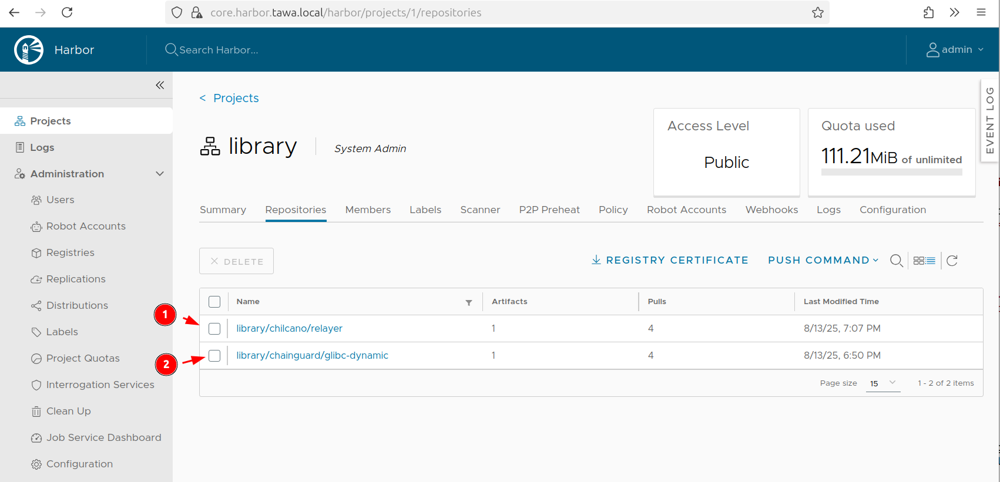
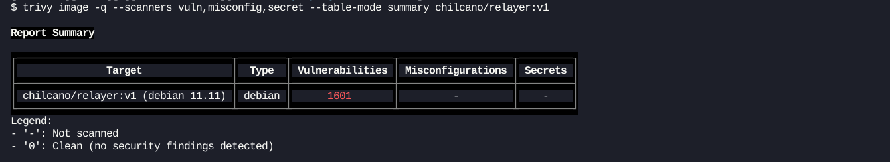
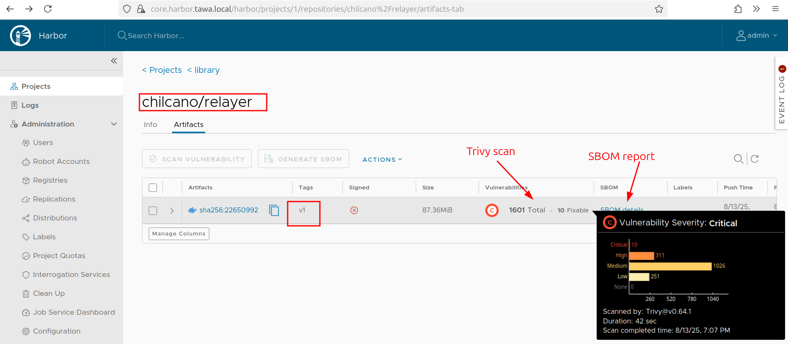
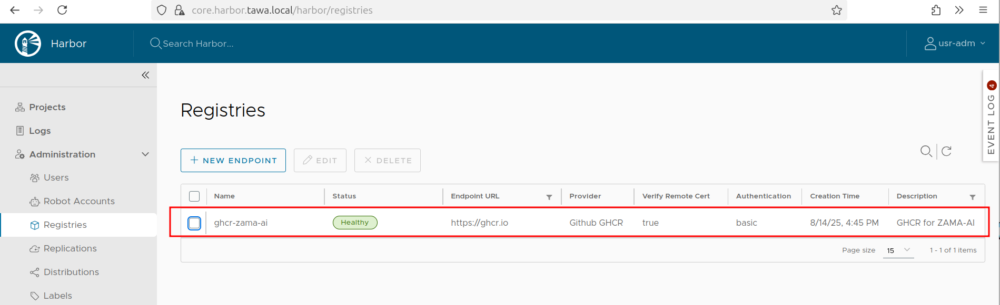
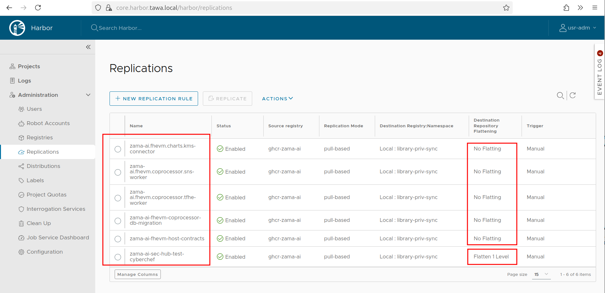
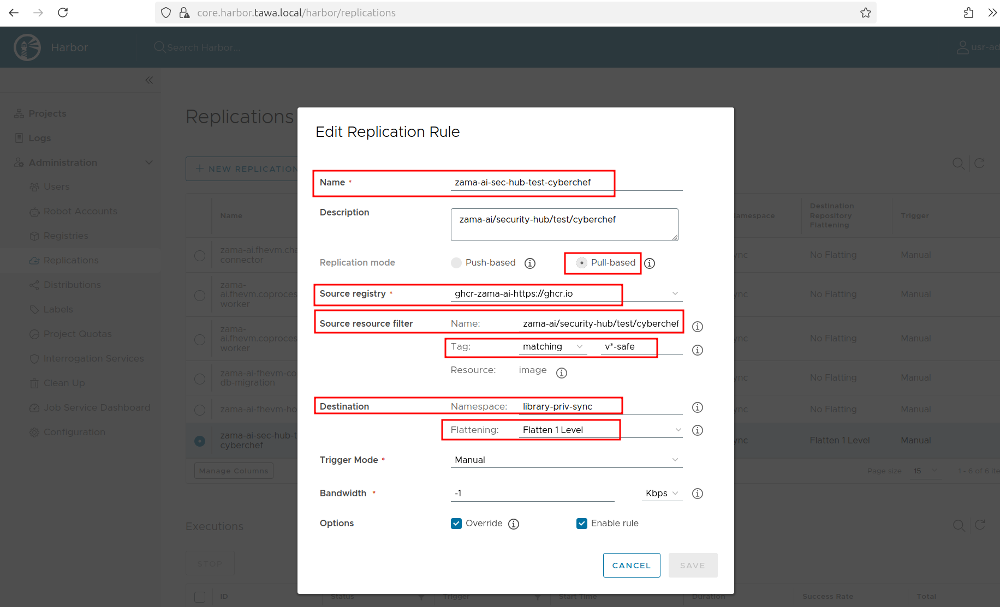

# Harbor as a Container Registry in Microk8s

## References

* https://vishynit.medium.com/setting-up-harbor-registry-on-kubernetes-using-helm-chart-5989d7c8df2a
* https://artifacthub.io/packages/helm/harbor/harbor/

## 1. Installation and configuration

### Step 1. Install Harbor helm hart

```sh
helm repo add harbor https://helm.goharbor.io
helm repo update

helm search repo harbor


NAME                            CHART VERSION   APP VERSION     DESCRIPTION                                       
aqua/harbor-scanner-aqua        0.14.0          0.14.0          Harbor scanner adapter for Aqua Enterprise scanner
aqua/harbor-scanner-trivy       0.31.2          0.31.2          Harbor scanner adapter for Trivy                  
harbor/harbor                   1.17.2          2.13.2          An open source trusted cloud native registry th...
```

### Step 2. Update harbor-values-microk8s.yaml

```sh
nano ./harbor-values-microk8s.yaml
```

### Step 3. Install Harbor

Let's install latest versions:
- app: 2.13.2
- chart: 1.17.2

```sh
helm install harbor harbor/harbor -f ./harbor-values-microk8s.yaml -n harbor --create-namespace --version 1.17.2

NAME: harbor
LAST DEPLOYED: Wed Aug 13 17:47:14 2025
NAMESPACE: harbor
STATUS: deployed
REVISION: 1
TEST SUITE: None
NOTES:
Please wait for several minutes for Harbor deployment to complete.
Then you should be able to visit the Harbor portal at https://core.harbor.tawa.local
For more details, please visit https://github.com/goharbor/harbor
```
### Step 4. Check installation

```sh
helm status harbor -n harbor

kubectl -n harbor get pod,svc,ing,pvc
```

..and you will have this:
```sh
$ kubectl -n harbor get pod,svc,ing,pvc
NAME                                    READY   STATUS    RESTARTS       AGE
pod/harbor-core-6f76d6d9c9-8l6qn        1/1     Running   0              3m16s
pod/harbor-database-0                   1/1     Running   0              3m16s
pod/harbor-jobservice-c69956c6d-r2hv5   1/1     Running   2 (3m5s ago)   3m16s
pod/harbor-portal-856bfddd77-bxb59      1/1     Running   0              3m16s
pod/harbor-redis-0                      1/1     Running   0              3m16s
pod/harbor-registry-5c9dcc5868-5mpb4    2/2     Running   0              3m16s
pod/harbor-trivy-0                      1/1     Running   0              3m16s

NAME                        TYPE        CLUSTER-IP       EXTERNAL-IP   PORT(S)             AGE
service/harbor-core         ClusterIP   10.152.183.117   <none>        80/TCP              3m16s
service/harbor-database     ClusterIP   10.152.183.225   <none>        5432/TCP            3m16s
service/harbor-jobservice   ClusterIP   10.152.183.172   <none>        80/TCP              3m16s
service/harbor-portal       ClusterIP   10.152.183.93    <none>        80/TCP              3m16s
service/harbor-redis        ClusterIP   10.152.183.196   <none>        6379/TCP            3m16s
service/harbor-registry     ClusterIP   10.152.183.223   <none>        5000/TCP,8080/TCP   3m16s
service/harbor-trivy        ClusterIP   10.152.183.85    <none>        8080/TCP            3m16s

NAME                                       CLASS    HOSTS                    ADDRESS     PORTS     AGE
ingress.networking.k8s.io/harbor-ingress   public   core.harbor.tawa.local   127.0.0.1   80, 443   3m16s

NAME                                                    STATUS   VOLUME                                     CAPACITY   ACCESS MODES   STORAGECLASS        VOLUMEATTRIBUTESCLASS   AGE
persistentvolumeclaim/data-harbor-redis-0               Bound    pvc-f5c07589-7b86-4107-ad00-d98116d844ef   1Gi        RWO            microk8s-hostpath   <unset>                 3m16s
persistentvolumeclaim/data-harbor-trivy-0               Bound    pvc-9da1a279-c417-4ef0-9ef9-01702afe227e   5Gi        RWO            microk8s-hostpath   <unset>                 3m16s
persistentvolumeclaim/database-data-harbor-database-0   Bound    pvc-e1522357-3c50-413e-907a-7cfc2dfea91e   1Gi        RWO            microk8s-hostpath   <unset>                 3m16s
persistentvolumeclaim/harbor-jobservice                 Bound    pvc-43eb4a97-ad4c-416d-a406-855752390254   1Gi        RWO            microk8s-hostpath   <unset>                 3m16s
persistentvolumeclaim/harbor-registry                   Bound    pvc-966b8984-82e7-4d1e-bdcd-e588ae8f8667   5Gi        RWO            microk8s-hostpath   <unset>                 3m16s
```

### Step 5. Access to Harbor from browser

First of all, in my case, I'll add a hostname in `/etc/hosts` in order to open harbor from browser.
```sh
echo "127.0.0.1 core.harbor.tawa.local" | sudo tee -a /etc/hosts
```

Now, let's open harbor: https://core.harbor.tawa.local
The password should be defined in `harborAdminPassword` of your `harbor-values-microk8s.yaml` file.

## 2. Playing with Harbor

### 1. Login into Harbor Registry

```sh
$ docker login --username admin core.harbor.tawa.local

Password: 

WARNING! Your credentials are stored unencrypted in '/home/chilcano/.docker/config.json'.
Configure a credential helper to remove this warning. See
https://docs.docker.com/go/credential-store/

Login Succeeded
```

### 2. List images

List remote images:
```sh
$ docker images core.harbor.tawa.local
REPOSITORY   TAG       IMAGE ID   CREATED   SIZE
```

List local images:
```sh
$ docker images
REPOSITORY                                                       TAG               IMAGE ID       CREATED        SIZE
cgr.dev/chainguard/glibc-dynamic                                 latest-dev        369b0dd814ac   4 days ago     57MB
chilcano/relayer                                                 v1                3052746f49da   6 weeks ago    228MB
```

### 3. Push local image to remote registry

We will update the local repository image path to new registry but keeping the image name and tag.
* This is the command to use: `docker tag <current-repository>:<tag> <harbor-registry-dns>/<project-name>/<new-repository>:<tag>` 
* The `<project-name>` will be the default one which is `library`. It is a public repo where I enable security scanning and SBOM generation.

__1. Retagging__
```sh
docker tag chilcano/relayer:v1 core.harbor.tawa.local/library/chilcano/relayer:v1
docker tag cgr.dev/chainguard/glibc-dynamic:latest-dev core.harbor.tawa.local/library/chainguard/glibc-dynamic:latest-dev
```

__2. Checking retagged images__
Now, I'll check if it was tagged.
```sh
docker images

REPOSITORY                                                       TAG               IMAGE ID       CREATED        SIZE
cgr.dev/chainguard/glibc-dynamic                                 latest-dev        369b0dd814ac   4 days ago     57MB
core.harbor.tawa.local/library/chainguard/glibc-dynamic          latest-dev        369b0dd814ac   4 days ago     57MB
core.harbor.tawa.local/library/chilcano/relayer                  v1                3052746f49da   6 weeks ago    228MB
chilcano/relayer                                                 v1                3052746f49da   6 weeks ago    228MB
```
The above list confirms that both images have been created.

__3. Pushing__
Now, let's to push to Harbor Registry.
```sh
docker push core.harbor.tawa.local/library/chilcano/relayer:v1
docker push core.harbor.tawa.local/library/chainguard/glibc-dynamic:latest-dev
```

### 4. Checking pushed images

__1. Using Harbor UI__  
You should have 2 images under `/library` repository in Harbor.


The Trivy scanner in Harbor will detect that `core.harbor.tawa.local/library/chilcano/relayer:v1` image has 1601 vulnerabilities, 
the same total of vulnerabilities reportedby Trivy in local registry.




__2. Using Harbor API__  
* By default, Harbor provides this RESTful API: https://core.harbor.tawa.local/devcenter-api-2.0

Some examples that don't require authentication:
```sh
$ curl -sk -X GET https://core.harbor.tawa.local/api/v2.0/projects | jq
$ curl -sk -X GET https://core.harbor.tawa.local/api/v2.0/projects/library | jq
```

Examples that do require authentication and proper admin role:

```sh
$ curl -sk -u "usr-fake:anypassword" https://core.harbor.tawa.local/api/v2.0/users 
{"errors":[{"code":"UNAUTHORIZED","message":"unauthorized"}]}
```

```sh
$ curl -sk -u "usr-01:rightpassword" https://core.harbor.tawa.local/api/v2.0/users 
{"errors":[{"code":"FORBIDDEN","message":"usr-01"}]}
```

```sh
$ curl -sk -u "usr-adm:rightpassword" https://core.harbor.tawa.local/api/v2.0/users | jq
```
```json
[
  {
    "admin_role_in_auth": false,
    "creation_time": "2025-08-14T10:37:31.928Z",
    "email": "usr-01@intix.info",
    "realname": "Usr 01",
    "sysadmin_flag": false,
    "update_time": "2025-08-14T10:37:31.928Z",
    "user_id": 7,
    "username": "usr-01"
  },
  {
    "admin_role_in_auth": false,
    "creation_time": "2025-08-14T10:40:08.155Z",
    "email": "usr-adm@intix.info",
    "realname": "Usr Adm",
    "sysadmin_flag": true,
    "update_time": "2025-08-14T10:40:13.472Z",
    "user_id": 8,
    "username": "usr-adm"
  }
]
```

```sh
$ curl -sk -u "usr-adm:rightpassword" https://core.harbor.tawa.local/api/v2.0/projects/library/artifacts | jq -r '.[] | "\(.type) \(.repository_name) \(.tags[0].name)"'
IMAGE library/chilcano/relayer v1
IMAGE library/chainguard/glibc-dynamic latest-dev

$ curl -sk -u "usr-adm:rightpassword" https://core.harbor.tawa.local/api/v2.0/usergroups
[]
```

### 5. Pushing images to private projects


__1. Push image from a guest user__

```sh
$ docker tag ghcr.io/zama-ai/security-hub/infra/eth-foundry:0.3.0 core.harbor.tawa.local/library-priv/security-hub/infra/eth-foundry:0.3.0

$ docker logout

## This is a guest user for the library-priv project
$ docker login --username usr-01 core.harbor.tawa.local

$ docker push core.harbor.tawa.local/library-priv/security-hub/infra/eth-foundry:0.3.0

The push refers to repository [core.harbor.tawa.local/library-priv/security-hub/infra/eth-foundry]
c742c066d4ef: Preparing 
...
a4804e6e2b24: Waiting 
unauthorized: unauthorized to access repository: library-priv/security-hub/infra/eth-foundry, action: push: unauthorized to access repository: library-priv/security-hub/infra/eth-foundry, action: push
```

__2. Push image from a dev user__

```sh
## This is a dev user for the library-priv project
$ docker login --username usr-dev core.harbor.tawa.local

$ docker push core.harbor.tawa.local/library-priv/security-hub/infra/eth-foundry:0.3.0

$ docker push core.harbor.tawa.local/library-priv/security-hub/infra/eth-foundry:0.3.0

The push refers to repository [core.harbor.tawa.local/library-priv/security-hub/infra/eth-foundry]
c742c066d4ef: Pushed 
...
a4804e6e2b24: Pushed 
0.3.0: digest: sha256:0cd2935a147045992a597f74d1a4932514ea07fdc6fce1345a4021e1bfb66202 size: 2427
```

__3. Pull image from a guest user__

```sh
## Remove from local fresh tagged image
$ docker rmi core.harbor.tawa.local/library-priv/security-hub/infra/eth-foundry:0.3.0

$ docker logout

## Login with guest user
$ docker login --username usr-01 core.harbor.tawa.local

## Pull from Harbor library-priv
$ docker pull core.harbor.tawa.local/library-priv/security-hub/infra/eth-foundry:0.3.0

## Checking
$ docker images | grep foundry

core.harbor.tawa.local/library-priv/security-hub/infra/eth-foundry   0.3.0             97a59c41b176   4 months ago   465MB
ghcr.io/zama-ai/security-hub/infra/eth-foundry                       0.3.0             97a59c41b176   4 months ago   465MB
```

### 6. System Robot Accounts

* https://goharbor.io/docs/2.13.0/administration/robot-accounts/

> System robot accounts are used to create non-user-scoped credentials to perform operations and API calls across multiple projects.
> These permissions can be combined and assigned to a system robot account, allowing it to execute the desired tasks via an OCI client or the Harbor API. 
> Robot Accounts cannot be used to log into the user interface.

### 7. Proxy Cache

* https://goharbor.io/docs/2.13.0/administration/configure-proxy-cache/

### 8. Registres Replication

* https://goharbor.io/docs/2.13.0/administration/configuring-replication/

> Replication allows users to replicate resources, namely images and charts, between Harbor and non-Harbor registries, in both pull or push mode.
> When the Harbor system administrator has set a replication rule, all resources, and any associated Cosign signatures, that match the defined 
filter patterns are replicated to the destination registry when the triggering condition is met.

#### 8.1. Define the replication plan

1. We want to pull specific images (tags, labels) from remote Registry.
2. Get a Registry Token or Credentials with read packages permission.

#### 8.2. Add an Endpoint for Source Registry

1. Configure the identified source Registry. In my case, I'll use ghcr.io
2. Add the corresponding Registry credentials. Read permissions is fine since we are going to pull containers only.



#### 8.2. Add as Replication Rules as imagenes are going to pull

> Github Container Registry can not be synced properly and have reported limitations. 
> That is why we need to create as Replication Rules as absolute docker images paths we want to replicate to Harbor.
> Once created all rules, we should tweak the `Destination Repository Flattening` option in order to remove source paths.



1. Click on New Replication Rule and set a proper name and description.
2. Set a proper rule name, replication mode (pull), source registry, source image, tag, label filters.  
3. Set a proper Destination: namespace and flattening. Tweak the Flattening Mode if that is needed.



#### 8.3. Trigger the Replication Rules

1. Run the Replication Rule accoringly Trigger Mode defined.

