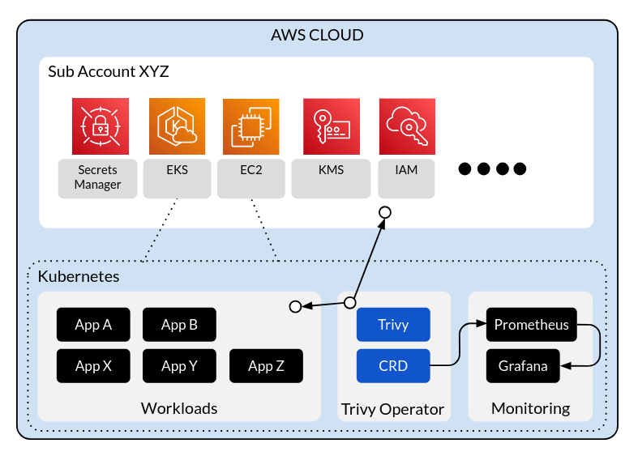
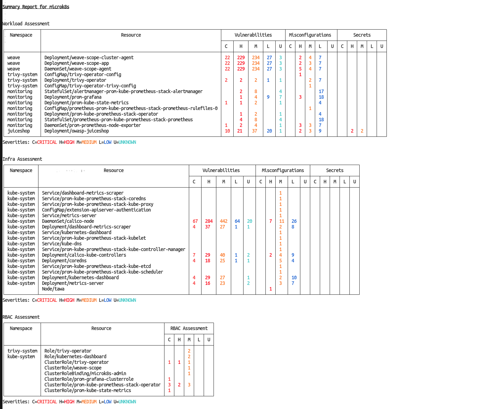
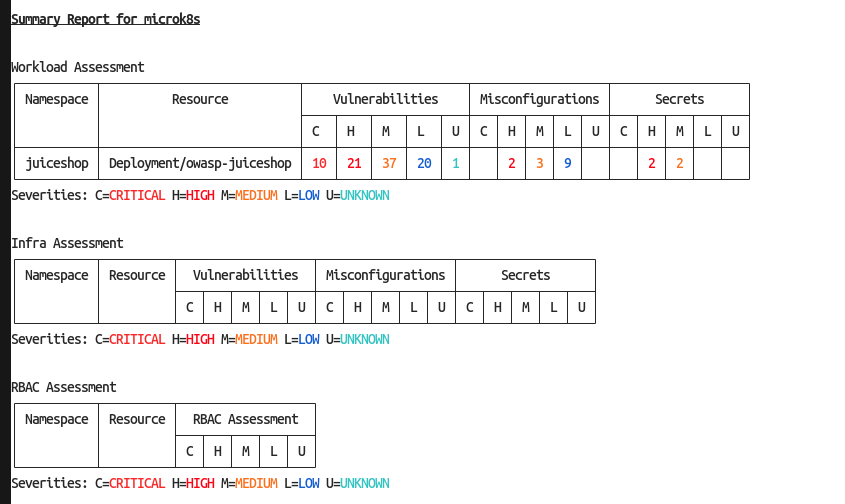
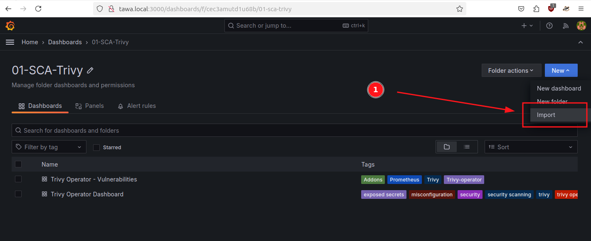

# Trivy Operator on Microk8s

- https://aquasecurity.github.io/trivy-operator/v0.23.0/tutorials/microk8s/
- https://microk8s.io/docs/security-trivy

> Next instructions should work to any K8s installation that support K8s Operator.

## 0. How Trivy Operator works




## 1. Install Microk8s

* Follow this guide: [Playing with MicroK8s](../playing_with_microk8s/)

## 2. Install Trivy Operator

### 2.1. Install Trivy Operator


**Pre-requisites**

1. Trivy Server pod requires PersistentVolumeClaim enabled in Microk8s. Enable `hostpath-storage` or `storage` (alias) addon.
```sh
microk8s enable hostpath-storage
```

2. In Microk8s, I had to install Prometheus stack before Trivy Operator, in that way `serviceMonitor: true` in Trivy config will allow to Prometheus metrics scrapping automatically.  
Just follow this guide: [Install Prometheus stack in Microk8s](../playing_with_microk8s/README.md#34-prometheus-and-grafana)

**Select k8s cluster by selecting the context**

```sh
kubectl config use-context microk8s
```

**Install Helm CLI in your PC**

I've followed this [reference](https://helm.sh/docs/intro/install/#from-apt-debianubuntu) instead of installing the Microk8s Helm or Helm3 addon.
```sh
curl https://baltocdn.com/helm/signing.asc | gpg --dearmor | sudo tee /usr/share/keyrings/helm.gpg > /dev/null
sudo apt-get install apt-transport-https --yes
echo "deb [arch=$(dpkg --print-architecture) signed-by=/usr/share/keyrings/helm.gpg] https://baltocdn.com/helm/stable/debian/ all main" | sudo tee /etc/apt/sources.list.d/helm-stable-debian.list
sudo apt-get update
sudo apt-get install helm

helm version

version.BuildInfo{Version:"v3.18.4", GitCommit:"d80839cf37d860c8aa9a0503fe463278f26cd5e2", GitTreeState:"clean", GoVersion:"go1.24.4"}
```

**Add the AquaSecurity Helm repo**

```sh
kubectl config use-context microk8s

helm repo add aqua https://aquasecurity.github.io/helm-charts/
helm repo update
```

**List all helm-charts available**
```sh
helm search repo aqua

NAME                            CHART VERSION   APP VERSION     DESCRIPTION                                       
aqua/harbor-scanner-aqua        0.14.0          0.14.0          Harbor scanner adapter for Aqua Enterprise scanner
aqua/harbor-scanner-trivy       0.31.2          0.31.2          Harbor scanner adapter for Trivy                  
aqua/postee                     v2.14.0         v2.14.0         A Helm chart for Postee                           
aqua/starboard-operator         0.10.21         0.15.23         Keeps security report resources updated           
aqua/tracee                     0.23.1          0.23.1          Linux Runtime Security and Forensics using eBPF   
aqua/trivy                      0.16.1          0.64.1          Trivy helm chart                                  
aqua/trivy-operator             0.29.3          0.27.3          Keeps security report resources updated 
```

**Install Trivy Operator**
```sh
## Append "--debug" if you want to show debug logs
helm install trivy-operator aqua/trivy-operator -n trivy-system --create-namespace --version 0.29.3 -f ./trivy-operator-cfg/values-trivy-operator-min.yaml

## List installed chart
helm list -n trivy-system

NAME            NAMESPACE       REVISION        UPDATED                                         STATUS          CHART                   APP VERSION
trivy-operator  trivy-system    1               2025-07-11 17:47:09.321740516 +0200 CEST        deployed        trivy-operator-0.29.3   0.27.3 
```

**Update**
```sh
helm upgrade trivy-operator aqua/trivy-operator -n trivy-system --create-namespace --version <new-chart-version> -f ./trivy-operator-cfg/values-trivy-operator-min.yaml 
```

**Upgrading**

These commands upgrades from Trivy Operator helm chart `0.25.0` to `0.28.1`. Trivy Operator chart version `0.28.1` deploys the application version `0.26.1`:
```sh
# 1. Make sure you have added the repo de Aquasecurity
$ helm repo add aqua https://aquasecurity.github.io/helm-charts

# 2. Update the charts index
$ helm repo update

# 3. Upgrade it namespace 'trivy-system'. Append "--debug" if you want to show debug logs
$ helm upgrade trivy-operator aqua/trivy-operator --namespace trivy-system --version 0.28.1 --reuse-values

# 4. If previous cmd didn't work, try to mount the "/var/run/secrets/kubernetes.io/serviceaccount/token" in this way:
helm upgrade trivy-operator aqua/trivy-operator --namespace trivy-system --version 0.28.1 --reuse-values \
  --set extraArgs="{--token-file=/var/run/secrets/kubernetes.io/serviceaccount/token}"

# 5. Delete existing Trivy Jobs
$ kubectl -n trivy-system delete job `kubectl get jobs -n trivy-system -o custom-columns=:.metadata.name`

# 6. Check again the logs, error should disappear and check if you check if vulnerabilities reports have been generated.
$ kubectl -n trivy-system logs -f deployment/trivy-operator

± kubectl get vulnerabilityreports -o wide -A | wc -l              
44
```

**Uninstall**
```sh
## Make sure you are in your K8s cluster
kubectl config get-contexts 
kubectl config use-context microk8s

## Uninstall
helm uninstall trivy-operator -n trivy-system

## Should be empty
kubectl -n trivy-system get all

## Remove the CRDs
kubectl delete crd vulnerabilityreports.aquasecurity.github.io
kubectl delete crd exposedsecretreports.aquasecurity.github.io
kubectl delete crd configauditreports.aquasecurity.github.io
kubectl delete crd clusterconfigauditreports.aquasecurity.github.io
kubectl delete crd rbacassessmentreports.aquasecurity.github.io
kubectl delete crd infraassessmentreports.aquasecurity.github.io
kubectl delete crd clusterrbacassessmentreports.aquasecurity.github.io
kubectl delete crd clustercompliancereports.aquasecurity.github.io
kubectl delete crd clusterinfraassessmentreports.aquasecurity.github.io
kubectl delete crd sbomreports.aquasecurity.github.io
kubectl delete crd clustersbomreports.aquasecurity.github.io
kubectl delete crd clustervulnerabilityreports.aquasecurity.github.io
```

**Checking Trivy Operator**
```sh
kubectl -n trivy-system logs -f deployment/trivy-operator

kubectl get crd | sed -En 's/\.aquasecurity\.github\.io\s+.*//p'

clustercompliancereports
clusterconfigauditreports
clusterinfraassessmentreports
clusterrbacassessmentreports
clustersbomreports
clustervulnerabilityreports
configauditreports
exposedsecretreports
infraassessmentreports
rbacassessmentreports
sbomreports
vulnerabilityreports

## Getting the list and summary of all reports
## Cluster-based assessments
kubectl get clustercompliancereports -o wide
kubectl get clusterconfigauditreports -o wide
kubectl get clusterinfraassessmentreports -o wide
kubectl get clusterrbacassessmentreports -o wide
kubectl get clustersbomreports -o wide
kubectl get clustervulnerabilityreports -o wide
## Namespace-based assessments
kubectl get configauditreports -A -o wide | wc -l
kubectl get exposedsecretreports -A -o wide | wc -l
kubectl get infraassessmentreports -A -o wide | wc -l
kubectl get rbacassessmentreports -A -o wide | wc -l
kubectl get sbomreports -A -o wide | wc -l
kubectl get vulnerabilityreports -A -o wide | wc -l

## List installed K8s resources
kubectl -n trivy-system get deploy,pod,ds,cm,svc,ing 
```

**Checking Trivy configuration**

List installed K8s resources:
```sh
kubectl get deploy,pod,ds,svc -n trivy-system

NAME                             READY   UP-TO-DATE   AVAILABLE   AGE
deployment.apps/trivy-operator   1/1     1            1           4d23h

NAME                                  READY   STATUS    RESTARTS         AGE
pod/trivy-operator-667d769f4b-6n5bd   1/1     Running   11 (7h11m ago)   4d23h
pod/trivy-server-0                    1/1     Running   1 (7h11m ago)    26h


NAME                     TYPE        CLUSTER-IP       EXTERNAL-IP   PORT(S)    AGE
service/trivy-operator   ClusterIP   10.152.183.133   <none>        80/TCP     4d23h
service/trivy-service    ClusterIP   10.152.183.57    <none>        4954/TCP   26h
```

Retrieving Trivy Operator configuration:
```sh
# List all Trivy Operator configurations files
kubectl get cm -n trivy-system

NAME                                    DATA   AGE
configmap/kube-root-ca.crt              1      7d17h
configmap/trivy-operator                14     4d23h
configmap/trivy-operator-config         40     4d23h
configmap/trivy-operator-trivy-config   32     4d23h

# trivy-operator-trivy-config
kubectl get cm/trivy-operator-trivy-config -n trivy-system -o yaml | grep -E '\s+trivy\.(ignore|mode|server)'

  trivy.ignoreUnfixed: "true"
  trivy.mode: ClientServer
  trivy.serverURL: http://trivy-service.trivy-system:4954

# trivy-operator-config
kubectl get cm/trivy-operator-config -n trivy-system -o yaml | grep -E '\s+OPERATOR_METRICS_'

  OPERATOR_METRICS_BIND_ADDRESS: :8080
  OPERATOR_METRICS_CLUSTER_COMPLIANCE_INFO_ENABLED: "true"
  OPERATOR_METRICS_CONFIG_AUDIT_INFO_ENABLED: "false"
  OPERATOR_METRICS_EXPOSED_SECRET_INFO_ENABLED: "false"
  OPERATOR_METRICS_FINDINGS_ENABLED: "true"
  OPERATOR_METRICS_IMAGE_INFO_ENABLED: "true"
  OPERATOR_METRICS_INFRA_ASSESSMENT_INFO_ENABLED: "false"
  OPERATOR_METRICS_RBAC_ASSESSMENT_INFO_ENABLED: "false"
  OPERATOR_METRICS_VULN_ID_ENABLED: "true"
```

**Observations about configuration**

1. The `ignoreUnfixed: true` means that only fixed vulnerabilities will be included in the reports.

The generated vulnerabilities reports, even Prometheus metrics and Grafana Dashboard will show only fixed vulnerabilities.
You can verify that from Trivy CLI using the flag `--ignore-unfixed`.
```sh
$ trivy image -q --scanners vuln index.docker.io/bkimminich/juice-shop:v17.1.1 --ignore-unfixed | grep -E "^(Total|Failure)"

Total: 19 (UNKNOWN: 3, LOW: 4, MEDIUM: 11, HIGH: 1, CRITICAL: 0)
Total: 68 (UNKNOWN: 0, LOW: 19, MEDIUM: 23, HIGH: 21, CRITICAL: 5)
```
If you set `ignoreUnfixed: false`, then you will get fixed and unfixed vulnerabilities.
```sh
$ trivy image -q --scanners vuln index.docker.io/bkimminich/juice-shop:v17.1.1 | grep -E "^(Total|Failure)"

Total: 33 (UNKNOWN: 3, LOW: 16, MEDIUM: 13, HIGH: 1, CRITICAL: 0)
Total: 77 (UNKNOWN: 0, LOW: 19, MEDIUM: 25, HIGH: 23, CRITICAL: 10)
```

Now, in Prometheus and Grafana you should get exact values.


2. The `mode: ClientServer` means that Trivy Operator has been deployed in client/server mode.

**Checking if Trivy Operator has scanned K8s resources**

1. Install sample app in K8s, I'll install `juiceshop`
```sh
kubectl apply -f k8s-owasp-juiceshop.yaml

namespace/juiceshop created
deployment.apps/juiceshop created
service/juiceshop-svc created
ingress.networking.k8s.io/juiceshop-ing created
```
2. Check installation
```sh
kubectl -n juiceshop get pod,svc,ing 
```

3. After few minutes, we should see extra resources created by Trivy
```sh
kubectl -n juiceshop exposedsecretreports,vulnerabilityreports

NAME                                                                                   REPOSITORY              TAG       SCANNER   AGE   CRITICAL   HIGH   MEDIUM   LOW
exposedsecretreport.aquasecurity.github.io/replicaset-juiceshop-6c74f98bc6-juiceshop   bkimminich/juice-shop   v17.1.1   Trivy     19h   0          2      2        0

NAME                                                                                   REPOSITORY              TAG       SCANNER   AGE   CRITICAL   HIGH   MEDIUM   LOW   UNKNOWN
vulnerabilityreport.aquasecurity.github.io/replicaset-juiceshop-6c74f98bc6-juiceshop   bkimminich/juice-shop   v17.1.1   Trivy     19h   10         24     38       35    3
```

4. You can search for the `vulnerabilityreport` in entire k8s
```sh
kubectl get vulnerabilityreport -A -o wide
```

### 2.2. Integrating with Grafana/Prometheus

Just follow this guide: [Install Prometheus stack in Microk8s](../playing_with_microk8s/README.md#34-prometheus-and-grafana)

### 2.3. Access to Trivy Metrics Exporter

**With Port Forward**  
```sh
kubectl port-forward service/trivy-operator -n trivy-system 5000:80
```

Open Trivy Metrics Exporter URL in your browser:
* Trivy Metrics Exporter: http://tawa.local:5000


**With Ingress**  
Check Trivy Operator services:
```sh
kubectl get svc -n trivy-system

NAME             TYPE        CLUSTER-IP       EXTERNAL-IP   PORT(S)    AGE
trivy-operator   ClusterIP   10.152.183.133   <none>        80/TCP     3d22h
trivy-service    ClusterIP   10.152.183.57    <none>        4954/TCP   136m
```

Get Trivy Operator service:
```sh
kubectl get svc trivy-operator -n trivy-system -o yaml

...
spec:
  clusterIP: 10.152.183.133
  clusterIPs:
  - 10.152.183.133
  internalTrafficPolicy: Cluster
  ipFamilies:
  - IPv4
  ipFamilyPolicy: SingleStack
  ports:
  - appProtocol: TCP
    name: metrics
    port: 80
    protocol: TCP
    targetPort: metrics
...
```

Define an Ingress:
```sh
cat trivy-operator-cfg/trivy-exporter-ingress.yaml

---
kind: Ingress
apiVersion: networking.k8s.io/v1
metadata:
  name: trivy-operator-ing
  namespace: trivy-system
spec:
  ingressClassName: nginx
  rules:
  - host: trivy-exporter.tawa.local
    http:
      paths:
      - path: /
        pathType: Prefix
        backend:
          service:
            name: trivy-operator
            port:
              number: 80
```

Deploy the Ingress:
```sh
kubectl apply -f trivy-operator-cfg/trivy-exporter-ingress.yaml
```

Add the Trivy Exporter dns to `/etc/hosts`:
```sh
sudo bash -c 'echo "127.0.0.1 trivy-exporter.tawa.local" >> /etc/hosts'
```

Open the Trivy Metrics Exporter URL in your browser:
* http://trivy-exporter.tawa.local/metrics


## 3. Security scanning K8s with Trivy


### 3.1. Using Trivy CLI

**1. Scans entire K8s cluster and get summaries**

```sh
trivy k8s microk8s -q --report summary
```



**2. Scans specific namespace and get summaries**

Get available namespaces:
```sh
kubectl get ns

NAME              STATUS   AGE
default           Active   21d
juiceshop         Active   46h
kube-node-lease   Active   21d
kube-public       Active   21d
kube-system       Active   21d
monitoring        Active   2d18h
trivy-system      Active   2d19h
weave             Active   47h
```

Once selected the namespace, run the next command:
```sh
trivy k8s microk8s -q --include-namespaces juiceshop --report summary
```


The `juiceshop` namespace has zero vulnerabilities related to `Infra` and `RBAC`. 
However, if we scan the `kube-system`, we will have vulnerabilities found.
```sh
trivy k8s microk8s -q --include-namespaces kube-system --report summary

Summary Report for microk8s


Workload Assessment
┌───────────┬──────────┬───────────────────┬───────────────────┬───────────────────┐
│ Namespace │ Resource │  Vulnerabilities  │ Misconfigurations │      Secrets      │
│           │          ├───┬───┬───┬───┬───┼───┬───┬───┬───┬───┼───┬───┬───┬───┬───┤
│           │          │ C │ H │ M │ L │ U │ C │ H │ M │ L │ U │ C │ H │ M │ L │ U │
└───────────┴──────────┴───┴───┴───┴───┴───┴───┴───┴───┴───┴───┴───┴───┴───┴───┴───┘
Severities: C=CRITICAL H=HIGH M=MEDIUM L=LOW U=UNKNOWN


Infra Assessment
┌─────────────┬────────────────────────────────────────────────────────────┬──────────────────────────┬─────────────────────┬───────────────────┐
│  Namespace  │                          Resource                          │     Vulnerabilities      │  Misconfigurations  │      Secrets      │
│             │                                                            ├────┬─────┬─────┬────┬────┼───┬───┬────┬────┬───┼───┬───┬───┬───┬───┤
│             │                                                            │ C  │  H  │  M  │ L  │ U  │ C │ H │ M  │ L  │ U │ C │ H │ M │ L │ U │
├─────────────┼────────────────────────────────────────────────────────────┼────┼─────┼─────┼────┼────┼───┼───┼────┼────┼───┼───┼───┼───┼───┼───┤
│ kube-system │ Deployment/coredns                                         │ 4  │ 18  │ 25  │ 1  │ 1  │   │   │ 5  │ 4  │   │   │   │   │   │   │
│ kube-system │ Deployment/metrics-server                                  │ 4  │ 16  │ 23  │    │ 2  │   │   │ 3  │ 7  │   │   │   │   │   │   │
│ kube-system │ Service/dashboard-metrics-scraper                          │    │     │     │    │    │   │   │ 1  │    │   │   │   │   │   │   │
│ kube-system │ Service/prom-kube-prometheus-stack-kube-controller-manager │    │     │     │    │    │   │   │ 1  │    │   │   │   │   │   │   │
│ kube-system │ Service/prom-kube-prometheus-stack-kube-scheduler          │    │     │     │    │    │   │   │ 1  │    │   │   │   │   │   │   │
│ kube-system │ DaemonSet/calico-node                                      │ 67 │ 284 │ 442 │ 64 │ 20 │   │ 7 │ 11 │ 26 │   │   │   │   │   │   │
│ kube-system │ Deployment/calico-kube-controllers                         │ 7  │ 29  │ 40  │ 1  │ 2  │   │ 2 │ 4  │ 9  │   │   │   │   │   │   │
│ kube-system │ Deployment/kubernetes-dashboard                            │ 4  │ 29  │ 27  │    │ 1  │   │   │ 2  │ 10 │   │   │   │   │   │   │
│ kube-system │ Service/kube-dns                                           │    │     │     │    │    │   │   │ 1  │    │   │   │   │   │   │   │
│ kube-system │ Service/prom-kube-prometheus-stack-coredns                 │    │     │     │    │    │   │   │ 1  │    │   │   │   │   │   │   │
│ kube-system │ Deployment/dashboard-metrics-scraper                       │ 4  │ 37  │ 27  │ 1  │ 1  │   │   │ 2  │ 8  │   │   │   │   │   │   │
│ kube-system │ Service/metrics-server                                     │    │     │     │    │    │   │   │ 1  │    │   │   │   │   │   │   │
│ kube-system │ Service/prom-kube-prometheus-stack-kube-proxy              │    │     │     │    │    │   │   │ 1  │    │   │   │   │   │   │   │
│ kube-system │ Service/prom-kube-prometheus-stack-kubelet                 │    │     │     │    │    │   │   │ 1  │    │   │   │   │   │   │   │
│ kube-system │ ConfigMap/extension-apiserver-authentication               │    │     │     │    │    │   │   │ 1  │    │   │   │   │   │   │   │
│ kube-system │ Service/kubernetes-dashboard                               │    │     │     │    │    │   │   │ 1  │    │   │   │   │   │   │   │
│ kube-system │ Service/prom-kube-prometheus-stack-kube-etcd               │    │     │     │    │    │   │   │ 1  │    │   │   │   │   │   │   │
└─────────────┴────────────────────────────────────────────────────────────┴────┴─────┴─────┴────┴────┴───┴───┴────┴────┴───┴───┴───┴───┴───┴───┘
Severities: C=CRITICAL H=HIGH M=MEDIUM L=LOW U=UNKNOWN


RBAC Assessment
┌─────────────┬───────────────────────────┬───────────────────┐
│  Namespace  │         Resource          │  RBAC Assessment  │
│             │                           ├───┬───┬───┬───┬───┤
│             │                           │ C │ H │ M │ L │ U │
├─────────────┼───────────────────────────┼───┼───┼───┼───┼───┤
│ kube-system │ Role/kubernetes-dashboard │   │   │ 2 │   │   │
└─────────────┴───────────────────────────┴───┴───┴───┴───┴───┘
Severities: C=CRITICAL H=HIGH M=MEDIUM L=LOW U=UNKNOWN
```

The next command shows all detailed reports like `trivy image` does:
```sh
trivy k8s microk8s -q --include-namespaces juiceshop --report all
```

**3. Run a compliance assessment**

The `--compliance <security-checklist>` flag will be used in combination with `--report` and `--format`.
* Possible values of `<security-checklist>` are: `k8s-nsa-1.0`, `k8s-cis-1.23`, `eks-cis-1.4`, `rke2-cis-1.24`, `k8s-pss-baseline-0.1` and `k8s-pss-restricted-0.1`.

```sh
trivy k8s microk8s -q --compliance k8s-cis-1.23 --report summary

Summary Report for compliance: CIS Kubernetes Benchmarks v1.23
┌────────┬──────────┬─────────────────────────────────────────────────────────────────────────────────────────────────────────────────┬────────┬────────┐
│   ID   │ Severity │                                                  Control Name                                                   │ Status │ Issues │
├────────┼──────────┼─────────────────────────────────────────────────────────────────────────────────────────────────────────────────┼────────┼────────┤
│ 1.1.1  │   HIGH   │ Ensure that the API server pod specification file permissions are set to 600 or more restrictive                │  PASS  │   0    │
│ 1.1.2  │   HIGH   │ Ensure that the API server pod specification file ownership is set to root:root                                 │  PASS  │   0    │
│ 1.1.3  │   HIGH   │ Ensure that the controller manager pod specification file permissions are set to 600 or more restrictive        │  PASS  │   0    │
│ 1.1.4  │   HIGH   │ Ensure that the controller manager pod specification file ownership is set to root:root                         │  PASS  │   0    │
│ 1.1.5  │   HIGH   │ Ensure that the scheduler pod specification file permissions are set to 600 or more restrictive                 │  PASS  │   0    │
...
│ 5.7.1  │  MEDIUM  │ Create administrative boundaries between resources using namespaces (Manual)                                    │   -    │   -    │
│ 5.7.2  │  MEDIUM  │ Ensure that the seccomp profile is set to docker/default in your pod definitions                                │  FAIL  │   12   │
│ 5.7.3  │   HIGH   │ Apply Security Context to Your Pods and Containers                                                              │  FAIL  │   68   │
│ 5.7.4  │  MEDIUM  │ The default namespace should not be used                                                                        │  PASS  │   0    │
└────────┴──────────┴─────────────────────────────────────────────────────────────────────────────────────────────────────────────────┴────────┴────────┘

You are able to get the summary in JSON format:
```sh
trivy k8s microk8s -q --compliance k8s-cis-1.23 --report summary --format json -o microk8s.compliance.cis.summary.json

cat microk8s.compliance.cis.summary.json | jq 'del(.SummaryControls)'
```
This is the summary in JSON format. Shortened by convenience.
```json
{
  "ID": "k8s-cis-1.23",
  "Title": "CIS Kubernetes Benchmarks v1.23"
}
```

And you are able to get the entire report in JSON format:
```sh
trivy k8s microk8s -q --compliance k8s-cis-1.23 --report all --format json -o microk8s.compliance.cis.json
```

**4. Operating Trivy Server from the Trivy CLI**

If Trivy Operator has been deployed in client/server mode, then we can use Trivy Server to scan any target in a centric way.
To do that, we need to check if Trivy Server is running in K8s, once done, Trivy Server should be reachable from Trivy CLI.
In our case, we will expose the existing Trivy Server running in K8s through an ingress.

Check Trivy Operator services:
```sh
kubectl get svc -n trivy-system

NAME             TYPE        CLUSTER-IP       EXTERNAL-IP   PORT(S)    AGE
trivy-operator   ClusterIP   10.152.183.133   <none>        80/TCP     3d22h
trivy-service    ClusterIP   10.152.183.57    <none>        4954/TCP   136m
```

The `trivy-service` is the service used by Trivy Server instance:
```sh
kubectl get svc trivy-service -n trivy-system -o yaml

...
spec:
  clusterIP: 10.152.183.57
  clusterIPs:
  - 10.152.183.57
  internalTrafficPolicy: Cluster
  ipFamilies:
  - IPv4
  ipFamilyPolicy: SingleStack
  ports:
  - name: trivy-http
    port: 4954
    protocol: TCP
    targetPort: 4954
...
```

Define an Ingress:
```sh
cat trivy-operator-cfg/trivy-server-ingress.yaml

---
kind: Ingress
apiVersion: networking.k8s.io/v1
metadata:
  name: trivy-server-ing
  namespace: trivy-system
spec:
  ingressClassName: nginx
  rules:
  - host: trivy-server.tawa.local
    http:
      paths:
      - path: /
        pathType: Prefix
        backend:
          service:
            name: trivy-service
            port:
              number: 4954
```

Deploy the Ingress:
```sh
kubectl apply -f trivy-operator-cfg/trivy-server-ingress.yaml
```

Now, you can use the Trivy Server frpom Trivy CLI by using this URL in your Terminal:
* http://trivy-server.tawa.local

```sh
trivy --server http://trivy-server.tawa.local -q image alpine:3.10

trivy image ghcr.io/zama-ai/gateway-l2/sc-bundle:latest -q --server http://trivy-server.tawa.local | grep -E '^(Total|Failures)'

Total: 77 (UNKNOWN: 0, LOW: 57, MEDIUM: 18, HIGH: 1, CRITICAL: 1)
Total: 8 (UNKNOWN: 0, LOW: 6, MEDIUM: 0, HIGH: 2, CRITICAL: 0)
Total: 1 (UNKNOWN: 0, LOW: 1, MEDIUM: 0, HIGH: 0, CRITICAL: 0)
```

Further information about Trivy Server:
* https://trivy.dev/v0.59/docs/references/configuration/cli/trivy_server/

### 3.2. Using Trivy Operator

**0. List all new CRDs added by Trivy Operator**

```sh
kubectl get crd | sed -En 's/\.aquasecurity\.github\.io\s+.*//p'

clustercompliancereports
clusterconfigauditreports
clusterinfraassessmentreports
clusterrbacassessmentreports
clustersbomreports
clustervulnerabilityreports
configauditreports
exposedsecretreports
infraassessmentreports
rbacassessmentreports
sbomreports
vulnerabilityreports
```

**1. clustercompliancereports**

- Alias: `compliance`

```sh
## Get available Security Checklists
kubectl get compliance -o wide 
kubectl get clustercompliancereports -o wide

NAME                     AGE   FAIL   PASS
k8s-cis-1.23             20h   11     105
k8s-nsa-1.0              20h   5      22
k8s-pss-baseline-0.1     20h          11
k8s-pss-restricted-0.1   20h          17

## k8s-cis-1.23
kubectl describe compliance k8s-cis-1.23
kubectl get compliance k8s-cis-1.23 -o=jsonpath='{.status}' | jq '.summary'
kubectl get compliance k8s-cis-1.23 -o=json | jq '.status.summary'
## k8s-nsa-1.0
kubectl describe clustercompliancereports k8s-nsa-1.0
kubectl get clustercompliancereports k8s-nsa-1.0 -o=json | jq .
kubectl get clustercompliancereports k8s-nsa-1.0 -o=json | jq '.spec' | jq 'del(.compliance.controls)'
kubectl get clustercompliancereports k8s-nsa-1.0 -o=json | jq 'del(.metadata)' | jq 'del(.spec.compliance.controls)' | jq 'del(.status.summaryReport)'
```

**2. configauditreports**

```sh
## Get total of reports in all namespaces
kubectl get configauditreports -o wide -A | wc -l

## Get reports in namespace
kubectl get configauditreports -o wide -n juiceshop

NAME                                   SCANNER   AGE    CRITICAL   HIGH   MEDIUM   LOW
replicaset-owasp-juiceshop-c648dbbfd   Trivy     174m   0          1      3        9
service-owasp-juiceshop                Trivy     174m   0          0      0        0

## Get report in JSON format
kubectl get configauditreports replicaset-owasp-juiceshop-c648dbbfd -n juiceshop -o json | jq '.report.summary'
kubectl get configauditreports replicaset-owasp-juiceshop-c648dbbfd -n juiceshop -o json | jq 'del(.report)'
```

**3. exposedsecretreports**

```sh
## Get total of reports in all namespaces
kubectl get exposedsecretreports -o wide -A | wc -l

## Get reports in namespace
kubectl get exposedsecretreports -o wide -n juiceshop

NAME                                                   REPOSITORY              TAG       SCANNER   AGE    CRITICAL   HIGH   MEDIUM   LOW
replicaset-owasp-juiceshop-c648dbbfd-owasp-juiceshop   bkimminich/juice-shop   v17.1.1   Trivy     156m   0          2      2        0

## Get report in JSON format
kubectl describe exposedsecretreports -n juiceshop replicaset-owasp-juiceshop-c648dbbfd-owasp-juiceshop
kubectl get exposedsecretreports -n juiceshop replicaset-owasp-juiceshop-c648dbbfd-owasp-juiceshop -o json | jq 'del(.report)'
```

**4. infraassessmentreports**

```sh
## Get total of reports in all namespaces
kubectl get infraassessmentreports -o wide -A | wc -l

## Get reports in namespace
kubectl get infraassessmentreports -o wide -n kube-system

NAME                                                         SCANNER   AGE     CRITICAL   HIGH   MEDIUM   LOW
service-prom-kube-prometheus-stack-kube-controller-manager   Trivy     5h35m   0          0      0        0
service-prom-kube-prometheus-stack-kube-etcd                 Trivy     5h35m   0          0      0        0
service-prom-kube-prometheus-stack-kube-scheduler            Trivy     5h35m   0          0      0        0

## Get report in JSON format
kubectl get infraassessmentreports service-prom-kube-prometheus-stack-kube-controller-manager -n kube-system -o json | jq .
```

**5. rbacassessmentreports**

```sh
## Get total of reports in all namespaces
kubectl get rbacassessmentreports -o wide -A | wc -l

## Get reports in all namespaces
kubectl get rbacassessmentreports -o wide -A

NAMESPACE      NAME                                  SCANNER   AGE     CRITICAL   HIGH   MEDIUM   LOW
kube-system    role-kubernetes-dashboard             Trivy     5h37m   0          0      2        0
monitoring     role-prom-grafana                     Trivy     5h37m   0          0      0        0
trivy-system   role-trivy-operator                   Trivy     5h37m   0          0      2        0
trivy-system   role-trivy-operator-leader-election   Trivy     5h37m   0          0      0        0

## Get reports in single namespace
kubectl get rbacassessmentreports -o wide -n kube-system

NAME                        SCANNER   AGE     CRITICAL   HIGH   MEDIUM   LOW
role-kubernetes-dashboard   Trivy     5h39m   0          0      2        0

## Get report in JSON format
kubectl get rbacassessmentreports role-kubernetes-dashboard -n kube-system -o json | jq 'del(.metadata)'
kubectl get rbacassessmentreports role-kubernetes-dashboard -n kube-system -o json | jq '.report'
```
```json
{
  "checks": [
    {
      "category": "Kubernetes Security Check",
      "checkID": "KSV049",
      "description": "Some workloads leverage configmaps to store sensitive data or configuration parameters that affect runtime behavior that can be modified by an attacker or combined with another issue to potentially lead to compromise.",
      "messages": [
        "Role 'kubernetes-dashboard' should not have access to resource 'configmaps' for verbs [\"create\", \"update\", \"patch\", \"delete\", \"deletecollection\", \"impersonate\", \"*\"]"
      ],
      "remediation": "Remove write permission verbs for resource 'configmaps'",
      "severity": "MEDIUM",
      "success": false,
      "title": "Manage configmaps"
    },
    {
      "category": "Kubernetes Security Check",
      "checkID": "KSV113",
      "description": "Viewing secrets at the namespace scope can lead to escalation if another service account in that namespace has a higher privileged rolebinding or clusterrolebinding bound.",
      "messages": [
        "Role 'kubernetes-dashboard' shouldn't have access to manage secrets in namespace 'kube-system'"
      ],
      "remediation": "Manage namespace secrets are not allowed. Remove resource 'secrets' from role",
      "severity": "MEDIUM",
      "success": false,
      "title": "Manage namespace secrets"
    }
  ],
  "scanner": {
    "name": "Trivy",
    "vendor": "Aqua Security",
    "version": "0.23.0"
  },
  "summary": {
    "criticalCount": 0,
    "highCount": 0,
    "lowCount": 0,
    "mediumCount": 2
  }
}
```

**6. sbomreports**

```sh
## Get total of reports in all namespaces
kubectl get sbomreports -o wide -A | wc -l

## Get reports in single namespace
kubectl get sbomreports -o wide -n weave

NAME                                        REPOSITORY         TAG      SCANNER   AGE     COMPONENTS   DEPENDENCIES
daemonset-weave-scope-agent-scope-agent     weaveworks/scope   1.13.2   Trivy     5h17m   208          208
replicaset-876cd756d                        weaveworks/scope   1.13.2   Trivy     5h16m   208          208
replicaset-weave-scope-app-6c66bdfd58-app   weaveworks/scope   1.13.2   Trivy     5h16m   208          208

## Get report in JSON format
kubectl get sbomreports daemonset-weave-scope-agent-scope-agent -n weave -o json | jq '.report.summary'

{
  "componentsCount": 208,
  "dependenciesCount": 208
}

kubectl get sbomreports daemonset-weave-scope-agent-scope-agent -n weave -o json | jq '.report.components.dependencies'
```

**7. vulnerabilityreports**

```sh
## Get total of reports in all namespaces
kubectl get vulnerabilityreports -o wide -A | wc -l

## Get reports in single namespace
kubectl get vulnerabilityreports -o wide -n juiceshop

NAME                                                   REPOSITORY              TAG       SCANNER   AGE     CRITICAL   HIGH   MEDIUM   LOW   UNKNOWN
replicaset-owasp-juiceshop-c648dbbfd-owasp-juiceshop   bkimminich/juice-shop   v17.1.1   Trivy     5h19m   5          19     30       10    1

## ## Describe and get report in JSON format
kubectl describe vulnerabilityreports -n juiceshop replicaset-owasp-juiceshop-c648dbbfd-owasp-juiceshop
kubectl get vulnerabilityreports -n juiceshop replicaset-owasp-juiceshop-c648dbbfd-owasp-juiceshop -o json | jq .
kubectl get vulnerabilityreports -n juiceshop replicaset-owasp-juiceshop-c648dbbfd-owasp-juiceshop -o json | jq '.report.summary'

{
  "criticalCount": 5,
  "highCount": 19,
  "lowCount": 10,
  "mediumCount": 30,
  "noneCount": 0,
  "unknownCount": 1
}
```

### 3.3. Browsing Trivy findings through Grafana Dashboards

**01. Install sample applications (optional)**

I've installed:

* WeaveWorks Scope (Application to visualize K8s resources): https://github.com/weaveworks/scope
* OWASP JuiceShop (Vulnerable Application): https://github.com/juice-shop/juice-shop
* OWASP bWAPP (Another vulnerable Application): http://www.itsecgames.com/


**02. Install existing Grafana Dashboard**



Open Grafana in your browser and import the next Dashboards:

1. Trivy Operator Dashboard
  - Basic Dashboard that allows to explore vulnerabilities, misconfigs, rbac config and secrets. 
  - https://grafana.com/grafana/dashboards/17813-trivy-operator-dashboard/
2. Trivy Operator - Vulnerabilities
  - Rich Dashboard and include detailed findings for all K8s resources assessed.
  - https://grafana.com/grafana/dashboards/16337-trivy-operator-vulnerabilities/

