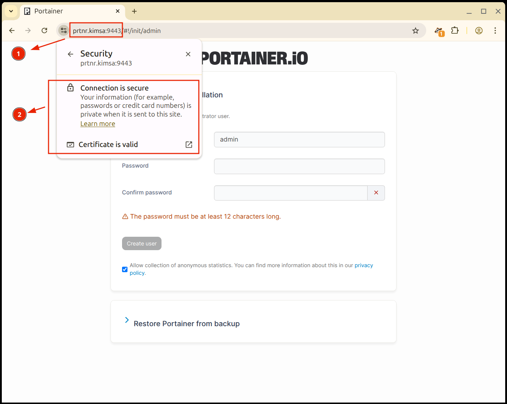

# Portainer installation with custom TLS certificate

## Steps

### 1. Install MKCert and dependencies

* MKCert will generate certificates.
* https://github.com/FiloSottile/mkcert

```sh
sudo apt -y install libnss3-tools

curl -JLO "https://dl.filippo.io/mkcert/latest?for=linux/amd64"
chmod +x mkcert-v*-linux-amd64
sudo cp mkcert-v*-linux-amd64 /usr/local/bin/mkcert
rm -rf mkcert-v*-linux-amd64
mkcert -version
v1.4.4
```

### 2. Install root certificates

```sh
mkcert -install

mkcert -CAROOT
/home/chilcano/.local/share/mkcert

ls -la /home/chilcano/.local/share/mkcert
-r--------  1 chilcano chilcano 2488 Feb 11 12:42 rootCA-key.pem
-rw-r--r--  1 chilcano chilcano 1684 Feb 11 12:42 rootCA.pem
```

### 3. Generate PC certificates

**Issue new certs**
```sh
mkdir -p ~/certs && cd ~/certs/

my_fqdn_list="prtnr.$(hostname) 127.0.0.1 $(hostname -i)" 
mkcert -cert-file portainer.crt -key-file portainer.key $my_fqdn_list

Created a new certificate valid for the following names 📜
 - "prtnr.kimsa"
 - "127.0.0.1"
 - "127.0.1.1"

The certificate is at "portainer.crt" and the key at "portainer.key" ✅

It will expire on 11 May 2028
```

**Check issued certs and appending root cert**
```sh
cat "$(mkcert -CAROOT)/rootCA.pem" >> ~/certs/portainer.crt
cp "$(mkcert -CAROOT)/rootCA.pem" ~/certs/.

ls -la ~/certs/.
-rw-r--r--   1 chilcano chilcano 3201 Feb 11 13:04 portainer.crt
-rw-------   1 chilcano chilcano 1708 Feb 11 13:02 portainer.key
-rw-r--r--   1 chilcano chilcano 1684 Feb 11 13:05 rootCA.pem
```

**Add new entry to `/etc/hosts`**  
The `prtnr.$(hostname)` entry shound be added to `/etc/hosts` because it is used as additional SAN in issued certificates.
```sh
echo "127.0.0.1 prtnr.$(hostname)" | sudo tee -a /etc/hosts

127.0.0.1 prtnr.kimsa
```

### 4. Install Portainer

* https://docs.portainer.io/start/install-ce/server/docker/linux

**Create the volume**
```sh
docker volume create portainer_data
```

**Portainer with self-signed certificate**
```sh
docker run -d -p 8000:8000 -p 9443:9443 --name portainer --restart=always \
  -v /var/run/docker.sock:/var/run/docker.sock \
  -v portainer_data:/data \
  portainer/portainer-ce:latest 
```

**Portainer with a custom certificate, created with mkcert***

```sh
docker run -d -p 8000:8000 -p 9443:9443 --name portainer --restart always \
  -v /var/run/docker.sock:/var/run/docker.sock \
  -v portainer_data:/data \
  -v $HOME/certs:/certs \
  portainer/portainer-ce:latest --tlscert /certs/portainer.crt --tlskey /certs/portainer.key 
```

**Portainer with docker-compose.yml file and custom certificate**

```yaml
name: portainer

services:
  portainer:
    image: portainer/portainer-ce:latest
    container_name: portainer
    restart: unless-stopped
    ports:
      - 8000:8000
      - 9443:9443
    volumes:
      - /var/run/docker.sock:/var/run/docker.sock
      - portainer_data:/data
      - $HOME/certs:/certs
    command:
      - --tlscert 
      - /certs/portainer.crt
      - --tlskey 
      - /certs/portainer.key

volumes:
  portainer_data: {}
```

**Check the Portainer container instance running**

```sh
$ docker ps

CONTAINER ID   IMAGE                           COMMAND                  CREATED         STATUS         PORTS                                                                                                NAMES
31795f71e179   portainer/portainer-ce:latest   "/portainer --tlscer…"   7 seconds ago   Up 6 seconds   0.0.0.0:8000->8000/tcp, [::]:8000->8000/tcp, 0.0.0.0:9443->9443/tcp, [::]:9443->9443/tcp, 9000/tcp   portainer

$ docker logs portainer

2026/02/11 12:36PM INF github.com/portainer/portainer/api/cmd/portainer/main.go:325 > encryption key file not present | filename=/run/secrets/portainer
2026/02/11 12:36PM INF github.com/portainer/portainer/api/cmd/portainer/main.go:365 > proceeding without encryption key |
2026/02/11 12:36PM INF github.com/portainer/portainer/api/database/boltdb/db.go:137 > loading PortainerDB | filename=portainer.db
2026/02/11 12:36PM INF github.com/portainer/portainer/api/chisel/service.go:200 > found Chisel private key file on disk | private-key=/data/chisel/private-key.pem
2026/02/11 12:36:39 server: Reverse tunnelling enabled
2026/02/11 12:36:39 server: Fingerprint cNnxzIcbaAqiZ8GxVH96IgP9KK6QSii494rDW7E2OSg=
2026/02/11 12:36:39 server: Listening on http://0.0.0.0:8000
2026/02/11 12:36PM INF github.com/portainer/portainer/api/cmd/portainer/main.go:636 > starting Portainer | build_number=269 go_version=go1.24.13 image_tag=2.33.7-linux-amd64 nodejs_version=18.x pnpm_version=10.26.2 version=2.33.7 webpack_version=5.88.2
2026/02/11 12:36PM INF github.com/portainer/portainer/api/http/server.go:367 > starting HTTPS server | bind_address=:9443
2026/02/11 12:36PM INF github.com/portainer/portainer/api/http/server.go:351 > starting HTTP server | bind_address=:9000
```

### 5. Using Portainer

* Once deployed, Portainer should be available on `https://<your-docker-hostname>:9443`. Where `<your-docker-hostname>` is the name of host where Portainer docker instance is running, in my case is `prtnr.kimsa`. If you don't know it, then you can use the IP address, and if you are in the same computer, you can use the `localhost` or `127.0.0.1`.
* You shouldn't see any warning or error about TLS Certificate in the Firefox or Chromer browser because we generated Portainer own cert, trusted on it and added the fqdn in `/etc/hosts`.



* Once created and update the admin user, you should restart the Portainer container: `docker restart portainer`