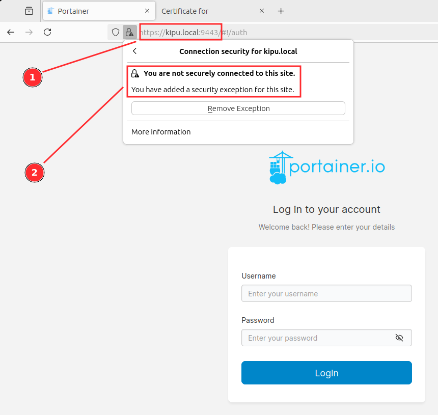

# Portainer installation with custom TLS certificate

## Steps

__1. Install MKCert and dependencies__

* MKCert will generate certificates.
* https://github.com/FiloSottile/mkcert

```sh
sudo apt -y install libnss3-tools

curl -JLO "https://dl.filippo.io/mkcert/latest?for=linux/amd64"
chmod +x mkcert-v*-linux-amd64
sudo cp mkcert-v*-linux-amd64 /usr/local/bin/mkcert
mkcert -version
v1.4.4
```

__2. Install root certificates and generate certificates__

```sh
mkdir -p ~/certs
cd ~/certs/
mkcert -install

mkcert -CAROOT
/home/chilcano/.local/share/mkcert

mkcert -cert-file portainer.crt -key-file portainer.key kipu kipu.local 127.0.0.1 ::1 192.168.1.169 192.168.1.174

cat "$(mkcert -CAROOT)/rootCA.pem" >> ~/certs/portainer.crt
cp "$(mkcert -CAROOT)/rootCA.pem" ~/certs/.

ls -la
-rw-r--r--  1 chilcano chilcano 1554 jul 16 14:31 portainer.crt
-rw-------  1 chilcano chilcano 1704 jul 16 14:31 portainer.key
-rw-r--r--  1 chilcano chilcano 1675 jul 16 15:52 rootCA.pem
```

__3. Install Portainer__

* https://docs.portainer.io/start/install-ce/server/docker/linux

```sh
docker volume create portainer_data

# Portainer with self-signed certificate
docker run -d -p 8000:8000 -p 9443:9443 --name portainer --restart=always -v /var/run/docker.sock:/var/run/docker.sock -v portainer_data:/data portainer/portainer-ce:latest
```

This command deploys Portainer with a custom certificate.
```sh
# Portainer with custom certificate
docker run -d -p 9443:9443 -p 8000:8000 --name portainer --restart always -v /var/run/docker.sock:/var/run/docker.sock -v portainer_data:/data -v /home/chilcano/certs:/certs portainer/portainer-ce:latest --sslcert /certs/portainer.crt --sslkey /certs/portainer.key
```

This `docker-compose.yml` file deploy Portainer with custom certificate:
```yaml
name: portainer

services:
  portainer:
    image: portainer/portainer-ce:latest
    container_name: portainer
    restart: unless-stopped
    ports:
      - 8000:8000
      - 9443:9443
    volumes:
      - /var/run/docker.sock:/var/run/docker.sock
      - portainer_data:/data
      - /home/chilcano/certs:/certs
    command:
      - --sslcert 
      - /certs/portainer.crt
      - --sslkey 
      - /certs/portainer.key

volumes:
  portainer_data: {}
```

__4. Checking Portainer__

Once deployed, Portainer should be available on `https://<your-docker-hostname>:9443`.
Where `<your-docker-hostname>` is the name of host where Portainer docker instance is running, in my case is `kipu.local`. 
If you don't know it, then you can use the IP address, in my case is `192.168.1.169`, and if you are in the same computer, you can use the `localhost` or `127.0.0.1`.

Although I've used MKCERT to generate a custom certificate (see step 2.) with custom SAN (Subject Alt Names), in the browser you will see a warning message:
* In Firefox: `Error code: SEC_ERROR_UNKNOWN_ISSUER`.
* In Brave: `NET::ERR_CERT_AUTHORITY_INVALID`.

> In both cases that means that the CA (Certificate Authority) who issued (signed) the TLS certificate that Portainer is using is not a trusted certificate.
> MKCERT creates a CA only for the specific host where Portainer is running, once created, it is used to sign the Portainer's TLS cerificate. 
> Since MKCERT has not installed the CA in the host's trusted certificate repository where Portainer is called, the above message always is shown, unless you manually install the CA as a trusted certificate in the browser.



