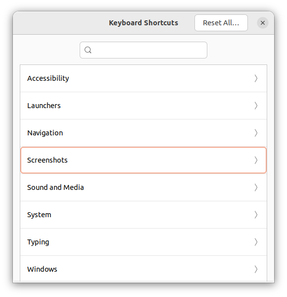
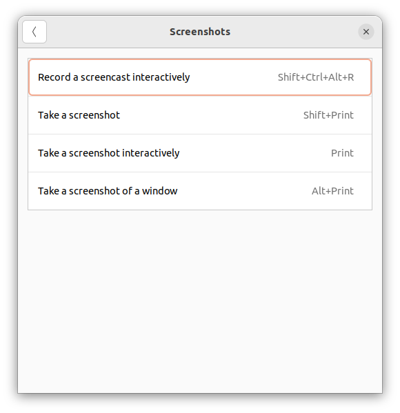

# Take screenshots silently in Ubuntu

When I attend to Webinars, Online Training or Online Demonstrations, several times I would like to take inmediately a screenshots of I'm viewing. Pressing the `Print` key will trigger an application to take a screenshot, sometimes it will take a screenshot of all desktop or you will have to select area or region to capture and also it will ask for a proper file name to save the image. In brief, that process never is quick and will require interaction.

I've created a simple bash script to take screenshots of active windows silently using a simple combination of keys or shortcuts like `Ctrl + Print`. We will need to make sure the `xfce4-screenshooter` be installed, you can use your favorite application if it can be executed from command line.

> __Note:__  
> __Ubuntu 22.04__ already takes screenshots silently by default. Below you can see the keyboard shortcuts to trigger different actions.

<table><tr><td>

</td><td>

</td></tr></table>

## Steps

1. Install the screencapturer application

```sh
sudo apt -yqq xfce4-screenshooter
```

2. Create your executable bash script into `/usr/local/sbin/`

```sh
cat << EOF > silent_screenshooter.sh
#!/bin/bash
set -euo pipefail

## only works with xfce4-screenshooter

TARGET=~/Screenshots
mkdir -p $TARGET
FILENAME=$(date +%Y%m%d_%H%M%S).png
DESTINATION=$TARGET/$FILENAME

# w: active windows
# o: launch external app
xfce4-screenshooter -w -o cat > $DESTINATION  
EOF
```
Or download it from here: 
```sh
wget https://raw.githubusercontent.com/chilcano/how-tos/main/src/silent_screenshooter.sh
```
Set it as executable script:
```sh
sudo mv silent_screenshooter.sh /usr/local/sbin/.
sudo chmod +x /usr/local/sbin/silent_screenshooter.sh
```

3. Set a shortcut to the executable bash script


Ubuntu 22.04 - Gnome

4. Test it.