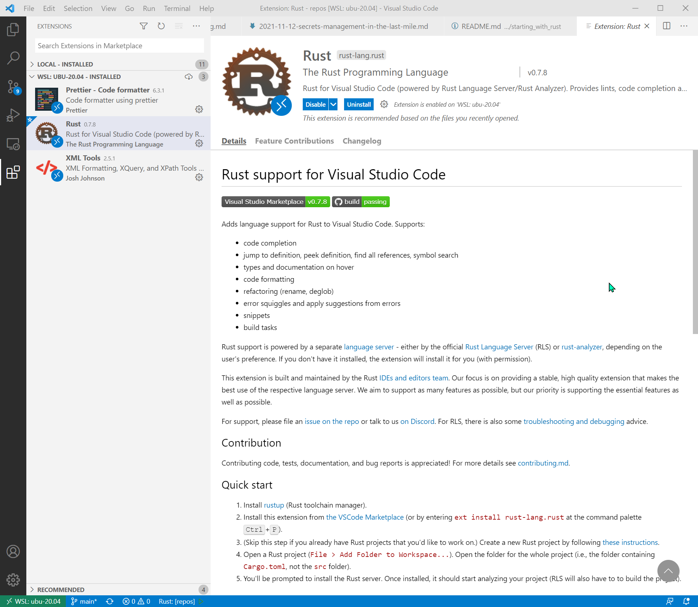

# 01 - Introduction

## Resources

* Web: https://www.rust-lang.org/
* Playground: https://play.rust-lang.org/

## 1. Install, checking and uninstall

### 1.1. Install

* Linux/Unix: 

```sh
// Recommended
curl --proto '=https' --tlsv1.2 -sSf https://sh.rustup.rs | sh

// Shorter version
curl https://sh.rustup.rs -sSf | sh
```

* WSL: 
```
curl --proto '=https' --tlsv1.2 -sSf https://sh.rustup.rs | sh
```

### 1.2. Check 

* Reload ENV: . $HOME/.bashrc
* Version: 

```sh
$ rustc -V

rustup 1.24.3 (ce5817a94 2021-05-31)
info: This is the version for the rustup toolchain manager, not the rustc compiler.
info: The currently active `rustc` version is `rustc 1.56.1 (59eed8a2a 2021-11-01)`

$ rustc -V
rustc 1.56.1 (59eed8a2a 2021-11-01)
```

* Files installed
```sh
$ ls -la $HOME/.cargo/bin

total 183896
drwxr-xr-x  2 rogerc rogerc     4096 Nov  8 19:35 .
drwxr-xr-x  3 rogerc rogerc     4096 Nov  8 19:35 ..
-rwxr-xr-x 12 rogerc rogerc 15690192 Nov  8 19:35 cargo
-rwxr-xr-x 12 rogerc rogerc 15690192 Nov  8 19:35 cargo-clippy
-rwxr-xr-x 12 rogerc rogerc 15690192 Nov  8 19:35 cargo-fmt
-rwxr-xr-x 12 rogerc rogerc 15690192 Nov  8 19:35 cargo-miri
-rwxr-xr-x 12 rogerc rogerc 15690192 Nov  8 19:35 clippy-driver
-rwxr-xr-x 12 rogerc rogerc 15690192 Nov  8 19:35 rls
-rwxr-xr-x 12 rogerc rogerc 15690192 Nov  8 19:35 rust-gdb
-rwxr-xr-x 12 rogerc rogerc 15690192 Nov  8 19:35 rust-lldb
-rwxr-xr-x 12 rogerc rogerc 15690192 Nov  8 19:35 rustc
-rwxr-xr-x 12 rogerc rogerc 15690192 Nov  8 19:35 rustdoc
-rwxr-xr-x 12 rogerc rogerc 15690192 Nov  8 19:35 rustfmt
-rwxr-xr-x 12 rogerc rogerc 15690192 Nov  8 19:35 rustup
```

### 1.3. Uninstall

* Uninstall: 

```sh
$ rustup self uninstall
```

## 2. Hello World and compile

```sh
$ mkdir 01-hola-mundo; cd 01-hola-mundo

$ code hola.rs
```

### 2.1. Compile and execute the binary

```sh
$ rustc hola.rs 

$ ls -la 
total 3584
drwxr-xr-x 2 rogerc rogerc    4096 Nov  8 20:11 ./
drwxr-xr-x 3 rogerc rogerc    4096 Nov  8 20:04 ../
-rwxr-xr-x 1 rogerc rogerc 3657024 Nov  8 20:11 hola*
-rw-r--r-- 1 rogerc rogerc      43 Nov  8 20:11 hola.rs

$ ./hola
Hola mundo!!
``` 

## 3. Working with Cargo

### 3.1. Create an empty project

```sh
$ mkdir 02-hola; cd 02-hola
$ cargo new hola-rust
    Created binary (application) `hola-rust` package
$ tree hola-rust

hola-rust
├── Cargo.toml
└── src
    └── main.rs

2 directories, 2 files

$ cat hola-rust/Cargo.toml 
[package]
name = "hola-rust"
version = "0.1.0"
edition = "2021"

# See more keys and their definitions at https://doc.rust-lang.org/cargo/reference/manifest.html

[dependencies]

$ cat hola-rust/src/main.rs 
fn main() {
    println!("Hello, world!");
}
``` 

### 3.2. Build and Run

```sh
$ cd hola-rust

$ cargo build
   Compiling hola-rust v0.1.0 (/home/rogerc/repos/how-tos/doc/starting_with_rust/02-hola/hola-rust)
    Finished dev [unoptimized + debuginfo] target(s) in 0.94s

$ tree .
.
├── Cargo.lock
├── Cargo.toml
├── src
│   └── main.rs
└── target
    ├── CACHEDIR.TAG
    └── debug
        ├── build
        ├── deps
        │   ├── hola_rust-71fca0324a7078a2
        │   └── hola_rust-71fca0324a7078a2.d
        ├── examples
        ├── hola-rust
        ├── hola-rust.d
        └── incremental
            └── hola_rust-3u0ew12ji9zyy
                ├── s-g422aq0xnr-1feyjuq-1hgu7o1g3j2cd
                │   ├── 1gw1q83bg03qr8gv.o
                │   ├── 1updcbax9138575w.o
                │   ├── 23iuw0zp2bf58qpn.o
                │   ├── 2x30n8f7jlthkn8g.o
                │   ├── 3at07c0nmiku4j8c.o
                │   ├── 3fhdm7dn12nl15i9.o
                │   ├── 49vilsmq68eo1bbu.o
                │   ├── 5bcp9tc7pyw3sn8b.o
                │   ├── dep-graph.bin
                │   ├── query-cache.bin
                │   ├── u6waa3ztjy98784.o
                │   ├── wor8mqrf87o0qtg.o
                │   └── work-products.bin
                └── s-g422aq0xnr-1feyjuq.lock

9 directories, 22 files

$ cargo run
    Finished dev [unoptimized + debuginfo] target(s) in 0.02s
     Running `target/debug/hola-rust`
Hello, world!
```

### 3.3. Run

We can remove `target/` and execute the application without running ``build`. The `run` command will build automatically.
```sh
$ rm -rf target/

$ cargo run
   Compiling hola-rust v0.1.0 (/home/rogerc/repos/how-tos/doc/starting_with_rust/02-hola/hola-rust)
    Finished dev [unoptimized + debuginfo] target(s) in 0.85s
     Running `target/debug/hola-rust`
Hello, world!
```


```sh
$ cd ../

$ cargo new hola-rust-exe --bin
    Created binary (application) `hola-rust-exe` package

$ tree hola-rust-exe/
hola-rust-exe/
├── Cargo.toml
└── src
    └── main.rs

1 directory, 2 files

$ cat Cargo.toml 
[package]
name = "hola-rust-exe"
version = "0.1.0"
edition = "2021"

# See more keys and their definitions at https://doc.rust-lang.org/cargo/reference/manifest.html

[dependencies]

$ cargo run
   Compiling hola-rust-exe v0.1.0 (/home/rogerc/repos/how-tos/doc/starting_with_rust/02-hola/hola-rust-exe)
    Finished dev [unoptimized + debuginfo] target(s) in 1.07s
     Running `target/debug/hola-rust-exe`
Hello, world!
```

## 4. Coding from VSCode

1. Install VSCode
2. Install Rust Extension for VSCode

