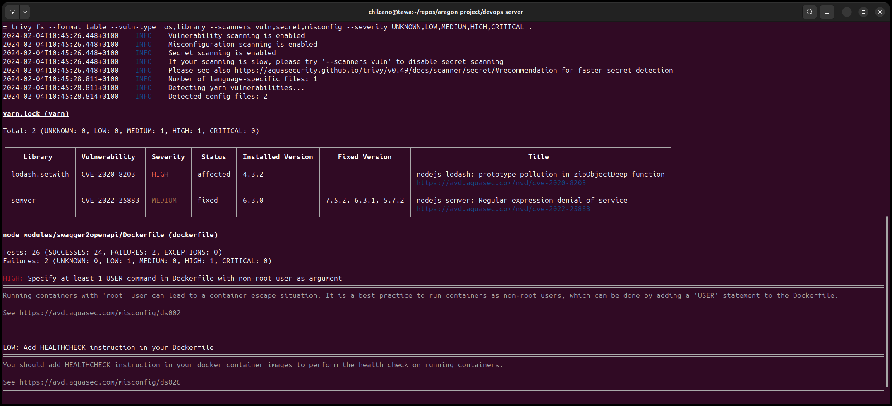
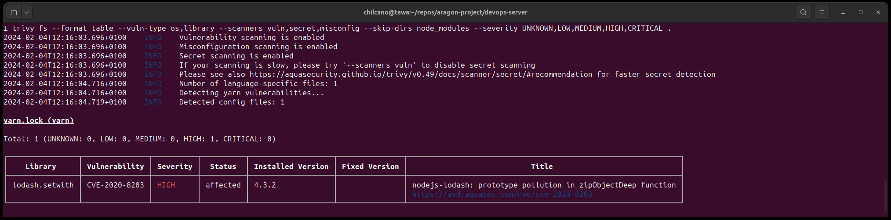

# Trivy - Security Dependencies Checking

## 1. Install


__1. From Debian/Ubuntu repos__

```sh
$ sudo apt-get install wget apt-transport-https gnupg lsb-release
$ wget -qO - https://aquasecurity.github.io/trivy-repo/deb/public.key | gpg --dearmor | sudo tee /usr/share/keyrings/trivy.gpg > /dev/null
$ echo "deb [signed-by=/usr/share/keyrings/trivy.gpg] https://aquasecurity.github.io/trivy-repo/deb $(lsb_release -sc) main" | sudo tee -a /etc/apt/sources.list.d/trivy.list
$ sudo apt-get update
$ sudo apt-get install trivy

```

__2. From Github released binary__

```sh
$ curl -sfL https://raw.githubusercontent.com/aquasecurity/trivy/main/contrib/install.sh | sh -s -- -b /usr/local/bin v0.57.0
```

```sh
Usage: $this [-b] bindir [-d] [tag]
  -b sets bindir or installation directory, Defaults to ./bin
  -d turns on debug logging
   [tag] is a tag from
   https://github.com/aquasecurity/trivy/releases
   If tag is missing, then the latest will be used.
```

To install latest version only for current user and debugging the installation, run this:
```sh
$ curl -sfL https://raw.githubusercontent.com/aquasecurity/trivy/main/contrib/install.sh | sh -s -- -b ~/.local/bin -d


aquasecurity/trivy info checking GitHub for latest tag
aquasecurity/trivy info found version: 0.49.0 for v0.49.0/Linux/64bit
aquasecurity/trivy debug downloading files into /tmp/tmp.rKAaOuXTpF
aquasecurity/trivy debug http_download https://github.com/aquasecurity/trivy/releases/download/v0.49.0/trivy_0.49.0_Linux-64bit.tar.gz
aquasecurity/trivy debug http_download https://github.com/aquasecurity/trivy/releases/download/v0.49.0/trivy_0.49.0_checksums.txt
aquasecurity/trivy info installed /home/chilcano/.local/bin/trivy
```

Checking installation:
```sh
$ trivy -v

Version: 0.49.0
```

* Further info: https://aquasecurity.github.io/trivy/v0.49/getting-started/installation/

__3. Integrate it with VSCode__

Trivy CLI must be installed before using it from VSCode. Once done, only install the Trivy extension from VSCode Marketplace.


## 2. Running Trivy


Clone any Github repository, go to a project directory to run Trivy from a Terminal.

### Example 01:

* Scan for vulns, secrets and misconfigs in local folder repo and send results to stdout.

```sh
$ trivy fs --format table --pkg-types os,library --scanners vuln,secret,misconfig --severity UNKNOWN,LOW,MEDIUM,HIGH,CRITICAL .
```

You will see these results in your terminal.



### Example 02:

* Skipping directories. This is convenient when dependencies were installed in local directory and we want to ignore vulnerabilities there. In this case we want to skip the `node_modules` dir.

```sh
$ trivy fs --format table --pkg-types os,library --scanners vuln,secret,misconfig --skip-dirs node_modules --severity UNKNOWN,LOW,MEDIUM,HIGH,CRITICAL .

```




### Example 03:

* Scan for vulns, secrets and misconfigs in local container image and send results to stdout.

Make sure you have a `Dockerfile` and `.dockerignore` files successfully created. With that, only build the image using proper name and tags.
```sh
$ docker build . -t chilcano/dops-srv-trivy:v1

$ docker images                            
REPOSITORY                       TAG          IMAGE ID       CREATED          SIZE
chilcano/dops-srv-trivy          v1           664a04c8e320   12 seconds ago   829MB
```
Once built the image, run Trivy to scan it. Note that this scan doesn't use `misconfig` option (`misconfig` is the new flag and replaces `config`) because I want to scan only for vulns in container image and not in other `Dockerfile` files included as examples in dependencies.
For example, the package `swagger2openapi-7.0.8` includes a Dockerfile that run commands as ROOT and Trivy will detect that as issue.

```sh
$ trivy image --format table --pkg-types os,library --scanners vuln,secret --severity UNKNOWN,LOW,MEDIUM,HIGH,CRITICAL chilcano/dops-srv-trivy:v1
```

You will have this output:


### Example 04:

* Running Trivy to scan vulns, secrets and misconfigs on local directory and generating HTML.

```sh
$ 
$ trivy fs --format template --template @/contrib/html.tpl --pkg-types os,library --scanners vuln,secret,misconfig --severity UNKNOWN,LOW,MEDIUM,HIGH,CRITICAL --output trivy-results-repo-55f3040.html .
```

* Using output template for JUnit.

```sh
$ trivy fs --format template --template @/contrib/junit.tpl --pkg-types os,library --scanners vuln,secret,misconfig --severity UNKNOWN,LOW,MEDIUM,HIGH,CRITICAL --output trivy-results-repo-55f3040.junit .
```

### Example 05:


* Scanning vulns, secrets and misconfig in a remote container image and send report to stdout

```sh
$ trivy image --format table --pkg-types os,library --scanners vuln,secret,misconfig --severity UNKNOWN,LOW,MEDIUM,HIGH,CRITICAL ghcr.io/aragon/devops-server:test-55f3040
```

### Example 06:

* Scanning vulns, leaked secrets and misconfig in remote container image and generate HTML report.
* Ref: https://aquasecurity.github.io/trivy/v0.57/docs/configuration/reporting/

> Seems that Trivy versions > v0.47 can not download the default (junit, html, etc.) template from Github.
> That is reason I download manually.

```sh
# download the proper template to get a report in a format desired, in this case it will be HTML
$ wget -q https://raw.githubusercontent.com/aquasecurity/trivy/main/contrib/html.tpl

$ mkdir trivy_out/ && mv html.tpl trivy_out/.

# run trivy and get a HTML report
$ trivy image --format template --template @html.tpl --pkg-types os,library --scanners vuln,secret,misconfig --severity UNKNOWN,LOW,MEDIUM,HIGH,CRITICAL weaveworksdemos/front-end:0.3.12 -o trivy_out/report-front-end-0.3.12.html 

# Trivy will search the docker image in DockerHub if it doesn't exist locally. It will not download the image.
$ trivy image --format template --template @html.tpl --pkg-types os,library --scanners vuln,secret,misconfig --severity UNKNOWN,LOW,MEDIUM,HIGH,CRITICAL weaveworksdemos/front-end:latest -o trivy_out/report-front-end-latest.html
```


### Example 07:

* Scanning vulns, leaked secrets and misconfig in remote and __private container image__ hosted in Github Container Registry
* You need a Github Personal Access Token in order to login into `ghcr.io` and we don't need to download the docker image to local at least we want to run a shell on it.
* Ref: https://github.com/aquasecurity/trivy/blob/main/docs/docs/advanced/private-registries/index.md

```sh
# login
$ CR_PAT="abc...1234567890"
$ echo $CR_PAT | docker login ghcr.io -u acmeuser --password-stdin

WARNING! Your password will be stored unencrypted in /home/acmeuser/.docker/config.json.
Configure a credential helper to remove this warning. See
https://docs.docker.com/engine/reference/commandline/login/#credentials-store

Login Succeeded

# download the proper template to get a report in a format desired, in this case it will be HTML
$ wget -q https://raw.githubusercontent.com/aquasecurity/trivy/main/contrib/html.tpl

$ mkdir trivy_out/ && mv html.tpl trivy_out/.

# run trivy and print report in stdout 
$ trivy image --format table --pkg-types os,library --scanners vuln,secret,misconfig --severity UNKNOWN,LOW,MEDIUM,HIGH,CRITICAL ghcr.io/chilcano/mac-address-manuf-lookup:main-5781d2c  

# run trivy and get a HTML report
$ trivy image --format template --template @html.tpl --pkg-types os,library --scanners vuln,secret,misconfig --severity UNKNOWN,LOW,MEDIUM,HIGH,CRITICAL ghcr.io/chilcano/mac-address-manuf-lookup:latest -o trivy_out/report-mac-address-manuf-lookup-latest.html 

# run trivy and get a JSON report. JSON tpl is not needed to be downloaded.
$ trivy image --format json --pkg-types os,library --scanners vuln,secret,misconfig --severity UNKNOWN,LOW,MEDIUM,HIGH,CRITICAL ghcr.io/chilcano/mac-address-manuf-lookup:latest -o trivy_out/report-mac-address-manuf-lookup-latest.json 
```

### Example 08:

* Scanning vulns, leaked secrets and misconfig in __remote git repo__ and __docker image__, and generate a single filterable/sortable rich HTML report.
* Ref: https://github.com/fatihtokus/scan2html

```sh
$ mkdir trivy_out/

# install fatihtokus/scan2html trivy plugin
$ trivy plugin install github.com/fatihtokus/scan2html

# check installed plugins
$ trivy plugin list

Installed Plugins:
  Name:    scan2html
  Version: 0.3.5

# upgrade plugin
$ trivy plugin upgrade scan2html

2024-11-20T15:49:54+01:00       INFO    [plugin] Upgrading plugin...    name="scan2html"
2024-11-20T15:50:05+01:00       INFO    [plugin] Plugin successfully installed  name="scan2html" version="0.3.8"
2024-11-20T15:50:05+01:00       INFO    [plugin] Plugin upgraded        name="scan2html" from="0.3.5" to="0.3.8"

# run trivy and print report in stdout 
$ trivy repo --format table --scanners vuln,secret,misconfig --severity UNKNOWN,LOW,MEDIUM,HIGH,CRITICAL https://github.com/microservices-demo/front-end

# scan remote repo and get JSON report
$ trivy repo -f json --scanners vuln,secret,misconfig --severity UNKNOWN,LOW,MEDIUM,HIGH,CRITICAL https://github.com/microservices-demo/front-end -o trivy_out/report-front-end.repo.json

# scan remote docker image and get JSON report
$ trivy image -f json --pkg-types os,library --scanners vuln,secret,misconfig --severity UNKNOWN,LOW,MEDIUM,HIGH,CRITICAL weaveworksdemos/front-end:0.3.12 -o trivy_out/report-front-end.0.3.12.image.json

# scan remote repo and get rich HTML report by using scan2html plugin
$ trivy scan2html repo --scanners vuln,secret,misconfig --severity UNKNOWN,LOW,MEDIUM,HIGH,CRITICAL https://github.com/microservices-demo/front-end \
  --scan2html-flags --output trivy_out/report-front-end.repo.rich.html 

# scan remote repo and get rich HTML report with updated TITLE by using scan2html plugin
$ trivy scan2html repo --scanners vuln,secret,misconfig --severity UNKNOWN,LOW,MEDIUM,HIGH,CRITICAL https://github.com/microservices-demo/front-end \
  --scan2html-flags --output trivy_out/report-front-end.repo.rich.title.html --report-title "SockShop Front-End Github Repository"

# scan remote repo with EPSS and get rich HTML report by using scan2html plugin
$ trivy scan2html repo --scanners vuln,secret,misconfig --severity UNKNOWN,LOW,MEDIUM,HIGH,CRITICAL https://github.com/microservices-demo/front-end \
  --scan2html-flags --with-epss --output trivy_out/report-front-end.repo.rich.epss.html 

# scan remote docker image and get rich HTML report by using scan2html plugin
$ trivy scan2html image --pkg-types os,library --scanners vuln,secret,misconfig --severity UNKNOWN,LOW,MEDIUM,HIGH,CRITICAL weaveworksdemos/front-end:0.3.12 \
  --scan2html-flags --output trivy_out/report-front-end.0.3.12.image.rich.html 

# merge repo and image json reports in single rich HTML report by using scan2html plugin (experimental)
$ trivy scan2html generate \
  --scan2html-flags --output trivy_out/report-front-end.merged.rich.html \
  --from trivy_out/report-front-end.repo.json trivy_out/report-front-end.0.3.12.image.json

# merge repo and image json files in single rich HTML report with EPSS by using scan2html plugin (experimental)
$ trivy scan2html generate \
  --scan2html-flags --with-epss --output trivy_out/report-front-end.merged.rich.epss.html \
  --from trivy_out/report-front-end.repo.json trivy_out/report-front-end.0.3.12.image.json

# scan remote **private** repo and get rich HTML report by using scan2html plugin
$ export GITHUB_TOKEN="your-github-token-with-read-permissions-to-private-repo"
$ trivy scan2html repo --scanners vuln,secret,misconfig --severity UNKNOWN,LOW,MEDIUM,HIGH,CRITICAL https://github.com/$ORG/$PRIVREPO trivy_out/report-privrepo.html 
```

* __Browse generated rich html reports:__ [https://github.com/chilcano/how-tos/tree/main/doc/trivy_out/](https://github.com/chilcano/how-tos/tree/main/doc/trivy_out/)

## Troubleshooting

### 1. RATELIMITING when downloading trivy-db

* Discussion: https://github.com/aquasecurity/trivy/discussions/7538
* Solution:
  
__01. Using Trivy CLI in Terminal or in Github workflow ('run' step)__

Append the `--db-repository` and `--java-db-repository` params with the corresponding values that don't have rate limiting.

```sh
trivy repo \
  --pkg-types os,library \
  --scanners secret,vuln,misconfig \
  --severity UNKNOWN,LOW,MEDIUM,HIGH,CRITICAL https://github.com/microservices-demo/front-end \
  --db-repository "public.ecr.aws/aquasecurity/trivy-db:2" \
  --java-db-repository "public.ecr.aws/aquasecurity/trivy-java-db:1" \
```

Or using `TRIVY_DB_REPOSITORY` and `TRIVY_JAVA_DB_REPOSITORY` environment variables:
```sh
export TRIVY_DB_REPOSITORY="public.ecr.aws/aquasecurity/trivy-db:2"
export TRIVY_JAVA_DB_REPOSITORY="public.ecr.aws/aquasecurity/trivy-java-db:1"

trivy repo \
  --pkg-types os,library \
  --scanners secret,vuln,misconfig \
  --severity UNKNOWN,LOW,MEDIUM,HIGH,CRITICAL https://github.com/microservices-demo/front-end 
```

If it is a _private repo_, then you need to provide a valid Github token with at least `read` permissions:
```sh
export GITHUB_TOKEN="your-github-token-with-read-permissions"

trivy repo --pkg-types os,library --scanners secret,vuln,misconfig --severity UNKNOWN,LOW,MEDIUM,HIGH,CRITICAL https://github.com/zama-ai/fhevm-backend
```

__02. Using Trivy Github Action__

Adds 2 environment variables `TRIVY_DB_REPOSITORY` and `TRIVY_JAVA_DB_REPOSITORY` to Github step context.

```yaml
...
      - name: Scan Local Docker Image using Trivy
        uses: aquasecurity/trivy-action@915b19bbe73b92a6cf82a1bc12b087c9a19a5fe2    ## master
        with:
          scan-type: image
          scanners: vuln,secret
          input: out/local-docker-oci-tar-file
          format: table
        env:
          TRIVY_DB_REPOSITORY: public.ecr.aws/aquasecurity/trivy-db:2
          TRIVY_JAVA_DB_REPOSITORY: public.ecr.aws/aquasecurity/trivy-java-db:1
```
If you want to scan a _private repo_, then you have to do in 2 steps. The first step if pull the private remote repo using Github `run` step and `git` CLI or with `actions/checkout`, in both cases you should provide the Github Token with `read` permissions.
The 2nd step is use the ` aquasecurity/trivy-action` 

```yaml
...
    steps:
      - name: Checkout private Repo
        uses: actions/checkout@11bd71901bbe5b1630ceea73d27597364c9af683    ## v4
        with:
          repository: zama-ai/fhevm-backend
          ref: main
          path: priv-repo/
          token: ${{ secrets.YOUR_GH_TOKEN_WITH_READ_PERMS }}

      - name: Scan Local Docker Image using Trivy
        uses: aquasecurity/trivy-action@915b19bbe73b92a6cf82a1bc12b087c9a19a5fe2    ## master
        with:
          scan-type: fs
          scanners: vuln,secret,misconfig
          scan-ref: priv-repo/.
          format: json
        env:
          TRIVY_DB_REPOSITORY: public.ecr.aws/aquasecurity/trivy-db:2
          TRIVY_JAVA_DB_REPOSITORY: public.ecr.aws/aquasecurity/trivy-java-db:1
```
