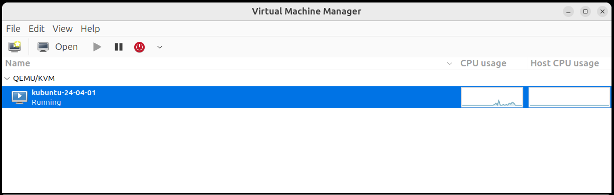
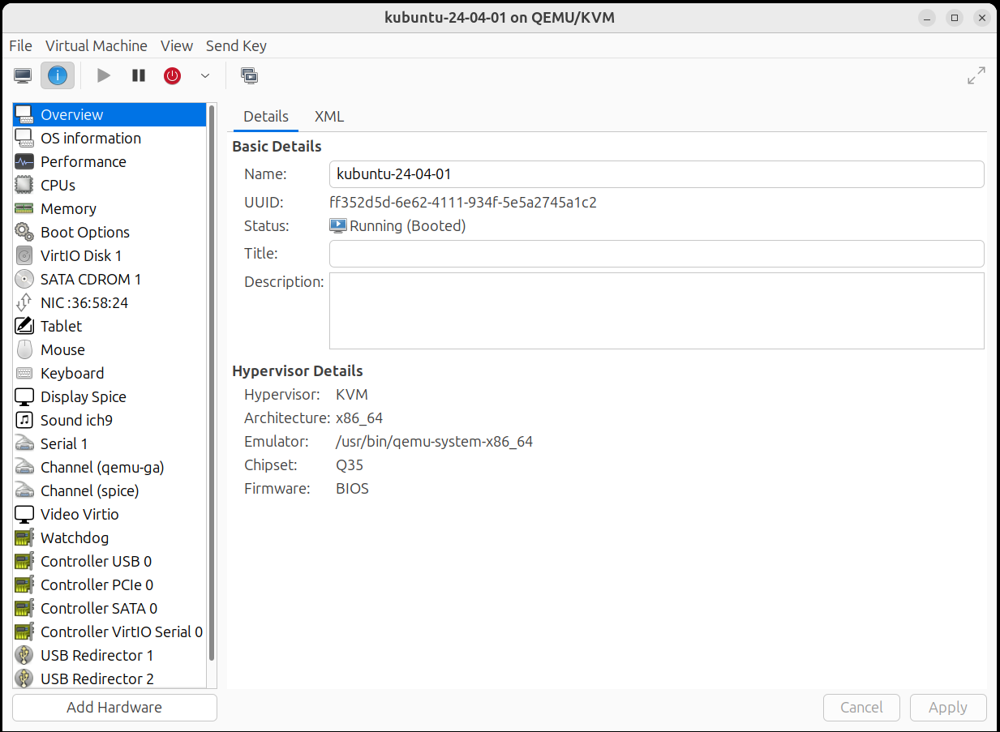
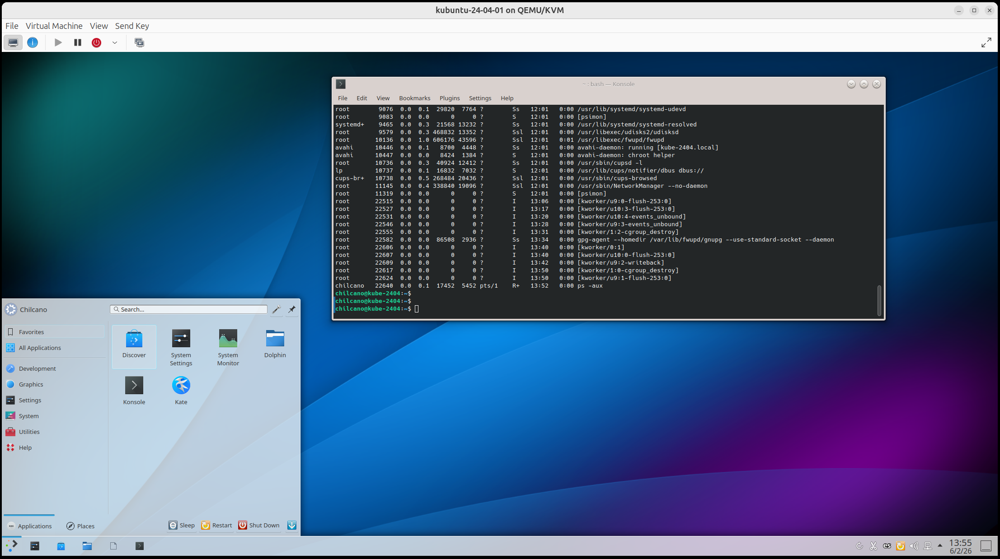

# KVM Virtualization with Virt

- Ref: https://www.cherryservers.com/blog/install-kvm-ubuntu

## Steps

### Step 1: Verify hardware virtualization support

**1. Check virtualization support**
```sh
lscpu | grep -E 'vmx|svm'
```

**2. Enable virtualization in BIOS/UEFI**

### Step 2: Install KVM and required packages

```sh
sudo apt update
sudo apt install -y qemu-kvm libvirt-daemon-system libvirt-clients bridge-utils virt-manager
```
This will install:
1. `qemu-kvm`: Installation of the KVM module and tools.
2. `libvirt-daemon-system` and `libvirt-clients`: Handle virtualization management services.
3. `bridge-utils`: Helps configure networking for VMs.
4. `virt-manager`: a GUI to manage virtual machines. This is not a compulsory addition for your virtual machine to work, but you might want to add this if needed.

### Step 3: Verify the KVM installation

**1. List VMs**
```sh
$ sudo virsh list --all
 Id   Name   State
--------------------
```

**2. Check KVM status**

```sh
sudo systemctl status libvirtd
```


### Step 4: Add user to KVM and Libvirt groups

```sh
sudo usermod -aG kvm,libvirt $USER
newgrp libvirt
```

### Step 5: Configure networking for virtual machines

**1. Verify NAT configuration**
```sh
$ sudo virsh net-list --all
[sudo] password for chilcano: 
 Name      State    Autostart   Persistent
--------------------------------------------
 default   active   yes         yes
```

### Step 6: Restart

Once restarted, you will not need to use `sudo` and many of services will be up and running.

```sh
$ virsh list --all
 Id   Name               State
----------------------------------
 1    kubuntu-24-04-01   running
```

### Step 7: Launch Virt-Manager and create a virtual machine

Run from terminal `virt-manager` or open `Virtual Machine Manager` from GUI.





