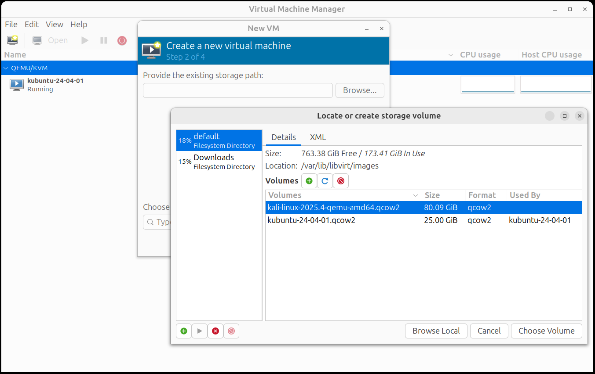
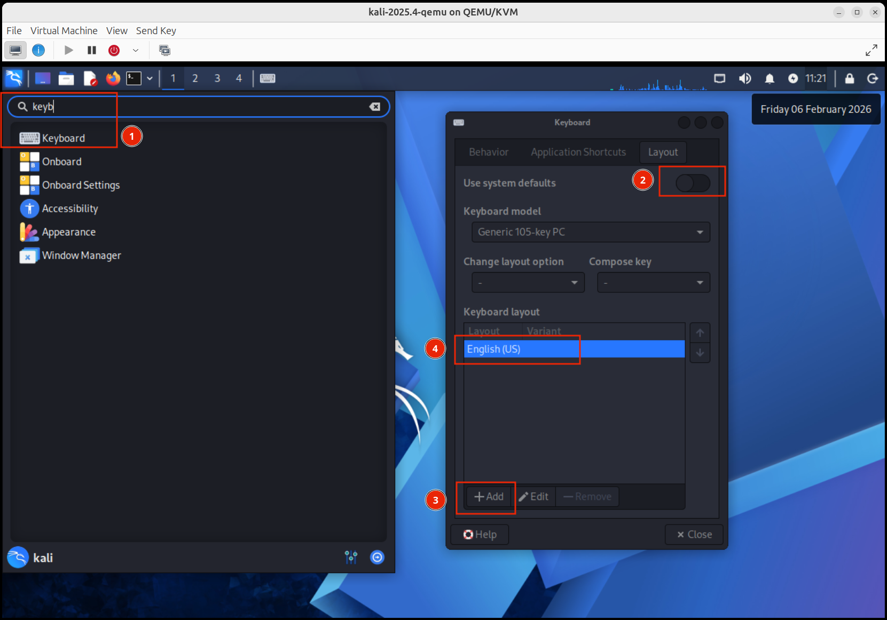

# Kali Linux guest VM with QEMU/KVM

- Ref: https://www.kali.org/docs/virtualization/install-qemu-guest-vm/

## Steps

### Verify you have installed Virt libs and GUI

First of all, you should have KMV/Virt, if you don't have it, then you can follow this [guide to install and configure KMV/Virt in Ubuntu](kvm-virt-manager-guide.md).

### Step 1: Download Kali Linux image

* Download the [QEMU ISO from here](https://www.kali.org/get-kali/#kali-virtual-machines).
* Once download, you will get a 7z file called `kali-linux-2025.4-qemu-amd64.7z` that should uncompressed.
* The uncompressed file will be `kali-linux-2025.4-qemu-amd64.qcow2`.
* Copy `kali-linux-2025.4-qemu-amd64.qcow2` to `/var/lib/libvirt/images/`, set the gid/uid and permissions.

```sh
sudo cp ~/Downloads/kali-linux-2025.4-qemu-amd64.qcow2 /var/lib/libvirt/images/.

sudo chown libvirt-qemu:kvm /var/lib/libvirt/images/kali-linux-2025.4-qemu-amd64.qcow2

sudo chmod 600 /var/lib/libvirt/images/kali-linux-2025.4-qemu-amd64.qcow2
```
* You should have this:
```sh
sudo ls -la /var/lib/libvirt/images/

total 23458416
drwx--x--x 2 root         root        4096 Feb  6 14:26 .
drwxr-xr-x 7 root         root        4096 Feb  5 20:48 ..
-rw------- 1 libvirt-qemu kvm  15719268352 Feb  6 14:26 kali-linux-2025.4-qemu-amd64.qcow2
-rw------- 1 libvirt-qemu kvm  26847870976 Feb  6 14:31 kubuntu-24-04-01.qcow2
```

### Step 2: Open Virt Manager GUI to import Kali disk image

A new virtual machine will be created using the previous copied disk image `/var/lib/libvirt/images/kali-linux-2025.4-qemu-amd64.qcow2`.

Follow the next screenshots to import the disk image.





### Step 3: Check and update the Kali virtual machine

Once imported and tweaked VM configuration (2 GiB RAM, 2 CPUs, 1 NICs, 80 GiB HD, etc.), Kali should be updated:

* Check Kali vm
    ```sh
    ┌──(kali㉿kali)-[~]
    └─$ cat /etc/os-release
    PRETTY_NAME="Kali GNU/Linux Rolling"
    NAME="Kali GNU/Linux"
    VERSION_ID="2025.4"
    VERSION="2025.4"
    VERSION_CODENAME=kali-rolling
    ID=kali
    ID_LIKE=debian
    HOME_URL="https://www.kali.org/"
    SUPPORT_URL="https://forums.kali.org/"
    BUG_REPORT_URL="https://bugs.kali.org/"
    ANSI_COLOR="1;31"
                                                                        
    ┌──(kali㉿kali)-[~]
    └─$ uname -a      
    Linux kali 6.18.5+kali-amd64 #1 SMP PREEMPT_DYNAMIC Kali 6.18.5-1kali1 (2026-01-19) x86_64 GNU/Linux
    ```

* Update Kali VM
```sh
┌──(kali㉿kali)-[~]
└─$ sudo apt -y update; sudo apt -y upgrade

┌──(kali㉿kali)-[~]
└─$ sudo apt autoremove -y  
```

### Step 4: Enable Spanish keyboard layout

Since I have a QWERTY Spanish Keyboard in the Host and Kali guest machine has US Keyboard Layout by default, then I should load the proper Spanish keyboard layout and force to use it rather than US one.




1. Open Keyboard applet from inside Kali VM
2. Disable "Use system defaults"
3. Add the new Keyboard Layout
4. Remove the English (US) Keyboard Layout.

...close and restart the VM. Now you should have a fully functional Kali VM.

## Additional Security Tools

### 1. IDEs

1. VSCode
2. Sublimetext

### 2. AI Tools

1. Claude
2. ChatGPT
3. [Strix - Open-source AI hackers](https://github.com/usestrix/strix)
4. [Shannon - Fully autonomous AI hacker](https://github.com/KeygraphHQ/shannon)
5. [MCP Server for Metasploit](https://github.com/GH05TCREW/MetasploitMCP)
6. Penligent/AI2PentestTool
  - [Using CLI for Kali/Debian](https://github.com/penligent/AI2PentestTool)
  - [Documentation](https://www.penligent.ai/docs)
  - [Using it - Youtube](https://www.youtube.com/watch?v=8xrRP3q4ceQ)
7. [Run YOUR own UNCENSORED AI & Use it for Hacking - Youtube](https://www.youtube.com/watch?v=XvGeXQ7js_o)
