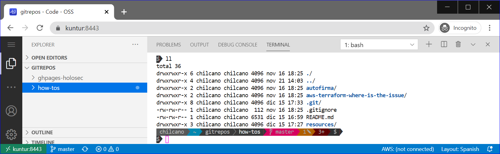

# Custom Prompt in Ubuntu with Powerline Go

If you don't want go through below steps, I've created a bash script to automate the process and get the same results. 
```sh
curl -s https://raw.githubusercontent.com/chilcano/how-tos/master/resources/custom_prompt_with_powerline_go.sh | bash
```

## Steps

### 1) Install Go
```sh
$ sudo apt install -y golang-go
```

### 2) Install Powerline-Go
```sh
$ go get -u github.com/justjanne/powerline-go
```

### 3) Set the Ubuntu prompt configuration

The delimiting identifier is quoted (`'EOF'`) to avoid the shell substitutes all variables, commands and special characters before passing the here-document lines to the command.   
We are not appending a minus sign to the redirection operator `<<-` to all leading tab characters to be consudered.   
Ref: https://linuxize.com/post/bash-heredoc/

```sh
$ cat << 'EOF' > powerline-go-loader.sh
#!/bin/bash
GOPATH=$HOME/go
export PATH="$GOPATH/bin:$PATH"

function _update_ps1() {
    PS1="$($GOPATH/bin/powerline-go -error $?)"
}
if [ "$TERM" != "linux" ] && [ -f "$GOPATH/bin/powerline-go" ]; then
    PROMPT_COMMAND="_update_ps1; $PROMPT_COMMAND"
fi
EOF

$ chmod +x powerline-go-loader.sh
$ mv -f powerline-go-loader.sh $HOME/powerline-go-loader.sh
$ echo '# Loading Powerline-Go' >> ~/.bashrc
$ echo '. $HOME/powerline-go-loader.sh' >> ~/.bashrc
```

### 4) Load configured Ubuntu prompt

#### Installing Fonts with Powerline glyphs.  
The Microsoft Cascadia Code Fonts includes the Powerline glyphs [here](https://github.com/microsoft/cascadia-code), we need to download and install it in your O.S.  
The Powerline-Go might work with any Fonts with already Powerline glyphs embeded. In [Nerd Fonts](https://www.nerdfonts.com) you have more fonts. 
```sh
$ PL_FONTS_URL=$(curl -s https://api.github.com/repos/microsoft/cascadia-code/releases/latest | jq -r -M '.assets[].browser_download_url')
$ PL_FONTS_FILENAME="${PL_FONTS_URL##*/}"
// PL_FONTS_FILENAME=$(basename -- "$PL_FONTS_URL")
$ PL_FONTS_NAME="${PL_FONTS_FILENAME%.*}"
$ PL_FONTS_EXTENSION="${PL_FONTS_FILENAME##*.}"

$ mkdir -p $HOME/.fonts/powerline/$PL_FONTS_NAME
$ wget -q $PL_FONTS_URL
$ sudo apt install unzip -y
$ unzip -oq $PL_FONTS_NAME -d $HOME/.fonts/powerline/$PL_FONTS_NAME
$ fc-cache -f $HOME/.fonts
```   

#### Reload the init bash script to apply the new styled Ubuntu prompt.
```sh
$ . ~/.bashrc
```
You should see below image with full prompt in 1 line:


### 5) Customize the Ubuntu prompt

I'd like to show the prompt in a two lines, first line for the full path and second line only with cursor. Then, to do that let's modify the `powerline-go-loader.sh`.  
The `powerline-go -help` command will show all parameters to customize your prompt. In this specific case I'll use `-newline`.
```sh
$ nano $HOME/powerline-go-loader.sh

#!/bin/bash
GOPATH=$HOME/go
export PATH="$GOPATH/bin:$PATH"

function _update_ps1() {
    PS1="$($GOPATH/bin/powerline-go -newline -error $?)"
}
if [ "$TERM" != "linux" ] && [ -f "$GOPATH/bin/powerline-go" ]; then
    PROMPT_COMMAND="_update_ps1; $PROMPT_COMMAND"
fi
```
Once changed, reload the init bash script.
```sh
$ . ~/.bashrc
```
You should see below images with a prompt in 2 lines.  

In [Code-Server Terminal](https://github.com/cdr/code-server):
  

In [Fluent Terminal](https://github.com/felixse/FluentTerminal):
  

In [Windows Terminal](https://github.com/microsoft/terminal):
  

### Reference:
- [Microsoft Tutorial: Set up Powerline in Windows Terminal](https://docs.microsoft.com/en-us/windows/terminal/tutorials/powerline-setup)
- [A Powerline style prompt for your shell](https://github.com/justjanne/powerline-go)
- [Microsoft Cascadia Code with Powerline glyphs](https://github.com/microsoft/cascadia-code)
